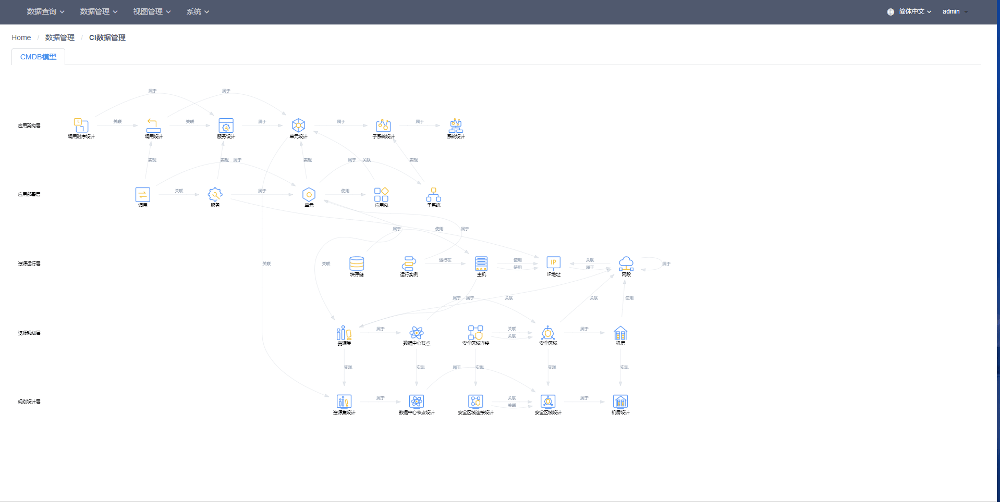
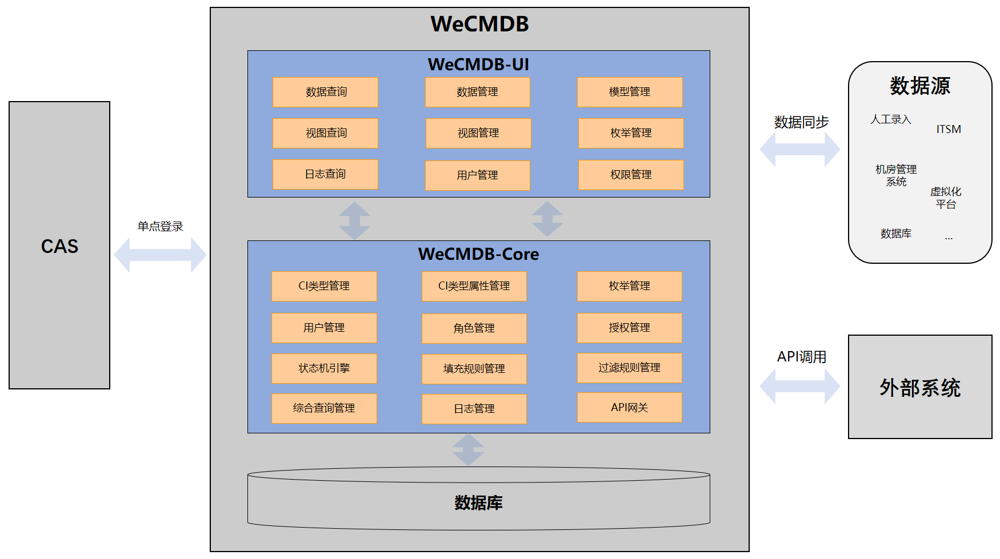

# Wecmdb

    
    
    
    
    
    
    

中文 / [English](README_EN.md)

## 在线体验环境
[点此体验WeCMDB](http://119.91.78.168:8090/wecmdb)  (用户/密码: admin/admin)  

 

> 注意：
>
> 1. 体验环境每天凌晨2:00-4:00进行重建，重建时间段内环境将不可用，且所有用户修改内容将被丢弃
> 2. 多人同时使用admin用户，可能会相互影响，若希望更好的体验可参照：[WeCMDB独立安装说明](wiki/docs/install_guide.md) 搭建私有环境

## 引言
在IT运维领域中，CMDB信息的准确性和完整性一直是行业内公认的挑战。如何保证企业的IT信息从物理层，到逻辑层，到应用层以及其关系信息被准确记录，以及如何利用CMDB的信息完成各种复杂的IT运维流程，甚至实现自动化、智能化，CMDB已成为IT运维可正常开展的基石。随着云计算和互联网业务高速发展，IT资源信息成几何级增加。如何管理日益增长的IT数据，拥有一套强大的CMDB系统显得尤为重要。

## 起源
WeCMDB（Configuration Management Database 配置管理数据库），是源自微众银行运维管理实践的的一套配置管理数据库系统。为高效支撑海量用户和巨量数据的互联网应用，
分布式架构被广泛采用于支撑当前的系统，然而分布式架构同时也刷新了运维管理的要求。相对于传统架构，分布式架构给IT基础架构带来了三个变化：海量的服务器、频繁的滚动发布、和复杂的服务间依赖关系。
由此带来的运维问题快速推动了DevOps工具的发展，以及智能运维管理理念的变化。

CMDB，作为运维工具的核心，提供了全体系IT信息唯一数据源，是IT运维自动化、智能化的基础和前提条件。依赖可靠的CMDB，IT信息从物理层（数据中心、机架机位、服务器、网络信息等），
到逻辑层（IP、系统架构信息），到应用层（业务应用系统信息）被完整的记录并管理起来。

## 系统架构
整体架构如下图：

 

## 简介
WeCMDB是集中配置数据中心，管理IT各层面组件及组件关系信息。同时与自动化运维管理工具紧密相联，支持运维管理工具及流程的运作，发挥配置信息的价值，同时依赖这些工具、流程保证数据准确性。

**WeCMDB具备以下特点：**

- 配置模型，动态扩展
	
	灵活添加配置项、属性及关系;属性数据类型、填充规则等均可动态定义。

- 配置查询，灵活多样
	
	在线自定义多配置关联查询。

- 细粒度权限管控
	
	实现了细粒度的数据权限控制；支持在线配置。

- 开放友好API服务
	
	支持在线定义接口可读写的配置项、属性及关系；支持在线测试，验证接口准确性。

- 多维度日志查询
	
	提供管理界面，支持多维度数据变迁历史查询。

## 主要功能
- 信息查询功能

	包括配置查询、综合查询、日志查询。

- 配置管理功能

	包括配置信息管理、基础配置查询、综合查询管理、综合查询接口配置。

- 视图管理功能
    包括IDC规划设计、IDC资源规划、应用架构设计、应用部署设计。

- 系统管理功能

	包括权限管理（角色管理，用户角色管理， 数据权限， 菜单管理）。

## 快速入门
WeCMDB常规容器化部署。

如何编译WeCMDB，请查看文档
[WeCMDB编译文档](wiki/docs/compile_guide.md)

如何安装WeCMDB， 请查看文档
[WeCMDB部署文档](wiki/docs/install_guide.md)

## 用户手册
关于WeCMDB模型说明， 请查看文档
[WeCMDB 模型说明手册](wiki/docs/wecmdb_model_guide.md)

关于WeCMDB的使用和操作说明， 请查看文档
[WeCMDB用户手册](wiki/docs/wecmdb_user_guide.md)

## 术语表
关于WeCMDB的使用到的术语，请查看文档
[WeCMDB 术语表](wiki/docs/manual/wecmdb_glossary.md)

## 版权声明
WeCMDB是基于 Apache License 2.0 协议， 详情请参考
[LICENSE](LICENSE)

## 社区
- 如果您想得到最快的响应，请给我们提[Issue](https://github.com/WeBankPartners/we-cmdb/issues/new/choose)或扫描下面的二维码，我们会第一时间反馈。

	

	
	

- 联系我们：fintech@webank.com
