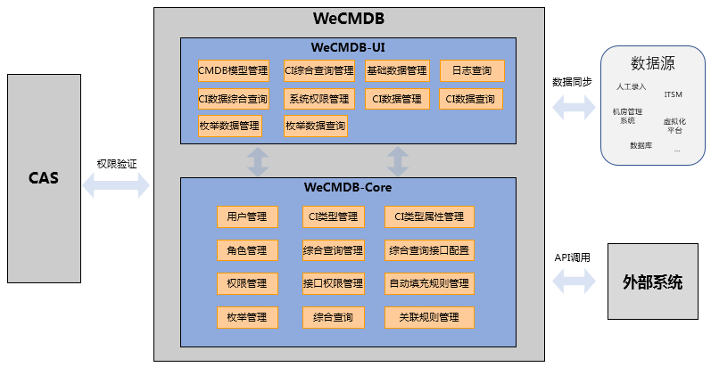
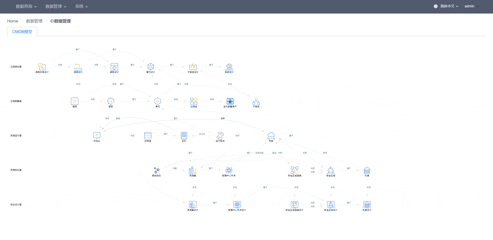

# WeCMDB

## 试用链接
[点此试用WeCMDB](http://111.230.161.237:28080/cmdb/index.html#/) 
用户名：*admin* 
密码：*123456*

## 引言
在IT运维领域中，CMDB信息的准确性和完整性一直是行业内公认的挑战。如何保证企业的IT信息从物理层，到逻辑层，到应用层以及其关系信息被准确记录，以及如何利用CMDB的信息完成各种复杂的IT运维流程，甚至实现自动化、智能化，CMDB已成为IT运维可正常开展的基石。随着云计算和互联网业务高速发展，IT资源信息成几何级增加。如何管理日益增长的IT数据，拥有一套强大的CMDB系统显得尤为重要。

## 起源
WeCMDB（Webank Configuration Management Database 微众配置管理数据库），是微众银行自研的一套配置管理数据库系统。

该产品经过微众银行多年在生产环境的验证，满足互联网银行管理全行IT资源的需求。该产品在微众银行业务迅速发展，信息量急剧增加，IT运维场景日趋复杂，信息准确性要求极高的背景下产生的，各种IT运维场景都得到实践验证。

依赖可靠的CMDB，IT信息从物理层（数据中心、机架机位、服务器、网络信息等），到逻辑层（IP、系统架构信息），到应用层（业务应用系统信息）被完整的记录并管理起来。

## 产品简介
WeCMDB是集中配置数据中心，管理IT各层面组件及组件关系信息。同时与自动化运维管理工具紧密相联，支持运维管理工具及流程的运作，发挥配置信息的价值，同时依赖这些工具、流程保证数据准确性。

WeCMDB具备以下特点：

- 配置模型，动态扩展
	
	灵活添加配置项、属性及关系;属性数据类型、填充规则等均可动态定义。

- 配置查询，灵活多样
	
	在线自定义多配置关联查询。

- 细粒度权限管控
	
	实现了细粒度的数据权限控制；支持在线配置。

- 开放友好API服务
	
	支持在线定义接口可读写的配置项、属性及关系；支持在线测试，验证接口准确性。

- 多维度日志查询
	
	提供管理界面，支持多维度数据变迁历史查询。

## 产品架构
WeCMDB1.0版本已经完成开发，整体架构如下图：

 

- WeCMDB1.0版本需要CAS服务提供鉴权能力，在WeCMDB1.1版本，会增加支持本地用户验证模式；
- WeCMDB1.0版本通过API对外提供数据服务。
- WeCMDB1.0版本支持从外部数据源导入数据。

## 主要功能
- 信息查询功能

	包括配置查询、综合查询、日志查询。

- 配置管理功能

	包括配置信息管理、基础配置查询、综合查询管理、综合查询接口配置。

- 系统管理功能

	包括权限管理（角色管理，用户角色管理， 数据权限， 菜单管理）。

## 快速入门
WeCMDB采用容器化部署。

如何编译WeCMDB，请查看以下文档
[WeCMDB编译文档](cmdb-wiki/docs/install/wecmdb_compile_guide.md)

如何安装WeCMDB， 请查看以下文档
[WeCMDB部署文档](cmdb-wiki/docs/install/wecmdb_install_guide.md)

## 用户手册
关于WeCMDB模型说明， 请查看以下文档
[WeCMDB 模型说明手册](cmdb-wiki/docs/manual/wecmdb_model_guide.md)

关于WeCMDB的使用和操作说明， 请查看以下文档
[WeCMDB用户手册](cmdb-wiki/docs/manual/wecmdb_user_guide.md)

## 开发者文档
WeCMDB使用Java和React JS进行开发，数据存储于MySQL，并依赖Tomcat Web容器运行。

请参考以下文档进行开发环境配置[WeCMDB开发环境配置](cmdb-wiki/docs/developer/wecmdb_developer_guide.md)

## API说明
关于WeCMDB的API说明， 请查看以下文档
[WeCMDB API手册](cmdb-wiki/docs/api/wecmdb_api_guide.md)

## License
WeCMDB是基于 Apache License 2.0 协议， 详情请参考
[LICENSE](LICENSE)

## 社区
- 如果您想得到最快的响应，请给我们提issue。
- 联系我们：fintech@webank.com

## 功能演示
- 设计 > CI数据管理

- 设计 > CI数据查询

- 设计 > CI综合查询管理

- 设计 > CI数据综合查询

- 设计 > 枚举数据管理

- 设计 > 枚举数据查询

- 系统 > 权限管理

- 系统 > 模型管理

- 系统 > 日志查询

- 系统 > 基础数据管理
