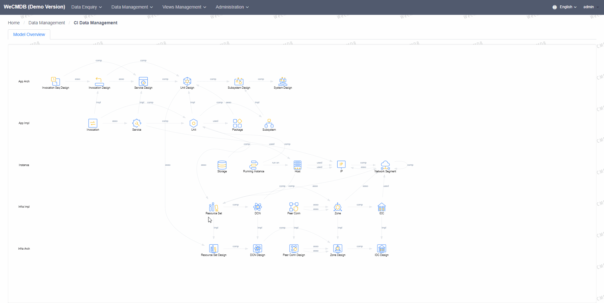
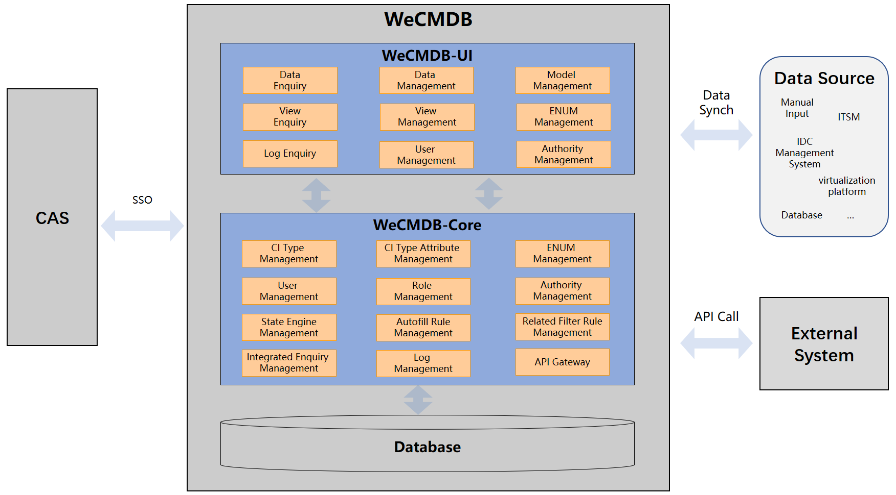

# Wecmdb

    
    
    
    
    
    
    

English / [中文](README.md)

## Live Demo
[Live Demo](http://119.91.78.168:8090/wecmdb)  (user/pass: admin/admin)  

> Note:
>  1. Live Demo will reset on 2:00 - 4:00am every day. The environment is not available during the period, and all changes will be discarded.
>  2. Multiple people use [admin] at the same time, may influence each other, if you want to get better experience, please set up your private environment refer to: [WeCMDB experience manaul](wiki/docs/install_guide.md)

## Introduction
To ensure the accuracy and the integrity of CMDB data is a widely recognized challenge in the domain of IT operation. In order to answer the questions such as "how to record with accuracy the IT information ranging from physical layer, logical layer to application layer as well as the relations between them", "how to accomplish complicated IT operation processes using those information" and "how to implement automation and intelligence", we realize that CMDB is becoming the foundation for carrying out IT operation properly. 

Furthermore, thanks to the rapid development of cloud computing technology and Internet business, IT information is increasing in a exponential pattern, a powerful CMDB system is especially important to manage this data growth. 

## Origin
WeCMDB is a configuration management database system originating from IT operation practices in WeBank. 

Distributed architecture has been widely adopted in order to support large amount of user traffic and data in Internet application systems. Compared to traditional system architecture, in the meanwhile, it also brings 3 changes to IT infrastructure: massive servers, frequent rolling deployment of applications and complex dependencies between services. These challeges quickly promote the development of DevOps tools and the new ideas in more intelligent IT operation management.

CMDB, as the core of IT operation tools, working as the single source of truth for information in the entire IT system, is the foundation and prerequisite for IT operation to become automated and intelligent. With a reliable CMDB, IT information ranging from physical layer (including data centers, chassises, positions, servers, network information, etc.), logical layer (IP addresses, architecture information) to application layer (information of business application systems) can all be recorded and managed properly.

## System Architecture
Architecture is as follows: 

 

## Summary
WeCMDB is a centralized store for configuration data, which is used to manage the information of components and the relations between those components in all layers of IT systems. It is closely related to the automation tools in IT operation as well as the processes they are caryying, so that these tools can function smoothly and the value of configuration data is well utilized. In the contrary, those tools and processcess are also playing an important role in keeping the configuration data accurate.

Here are the characteristics of WeCMDB:

- Extensible and Dynamic Data Model

  Configuration items, attributes and relations can be added easily, while data types and automatic value filling rules for each attribute can be defined in a dynamic way. 

- Flexible Query Configuration

  Queries involving multiple configuration items and relations can be customized on the fly.
  
- Fine-grained Authorization

  Fine-grained access control of data can be configured and take effect immediately.
  
- Open and Friendly API Service

  Customization of each interface on the configuration items, attributes and relations that it accesses is supported; online testing is provided to verify the accuracy of the interfaces.
  
- Multidimensional Queries on Logs

  Management console is provided to support queries with muliple dimensions on data transition history.

## Main Features
- Information Inquiry

  Support query on configuration data, integrated query and query on logs. 

- Configuration Management

  Support configuration data management, basic configuration query, integrated query management and interface configuration for integrated queries.

- View Management

  Support configuration management from different aspects,IDC planning design， IDC resource planning, application architecture design, application deployment design, which include graphic display all the configuration items of the selected aspects and you can maintain the items there easily.

- System Management

  Support authorization management (including users, roles, data permision and access to menu items).
  
## Quick Start
Normal deployment with containers of WeCMDB:

Please refer to the [WeCMDB Compiling Guide](wiki/docs/compile_guide.md) on how to compile WeCMDB.

Please refer to the [WeCMDB Deployment Guide](wiki/docs/install_guide.md) on how to install WeCMDB.

## User Manuals
Please refer to the [WeCMDB Model Guide](wiki/docs/wecmdb_model_guide_en.md) for guide on WeCMDB model.

Please refer to the [WeCMDB User Guide](wiki/docs/wecmdb_user_guide_en.md) for usage and operations.

## Glossary
Please refer to the [WeCMDB Glossary](wiki/docs/wecmdb_glossary_en.md) to understand the terms that used for WeCMDB.

## License
WeCMDB is licensed under the Apache License Version 2.0 , please refer to the [license](LICENSE) for details.

## Community
- For quick response, please [raise an issue](https://github.com/WeBankPartners/we-cmdb/issues/new/choose) to us, or you can also scan the following QR code to join our community, we will provide feedback as quickly as we can.

  

  
  

- Contact us: fintech@webank.com
