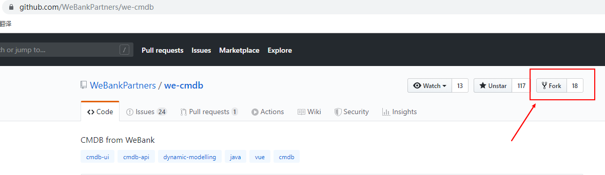

# Code contributors submit guidelines

## 步骤
###  fork项目

	进入we-cmdb仓库，点击右边的fork,fork的含义就是创建we-cmdb项目的副本作为你自已的项目
	点击"fork"
	
	
### fork之后的图如下图所示，从下图可以看出we-cmdb已经处于自已的github帐号库中，同时也可以发现github还标明了该库的来源，因为只有标明了来源，后面你修改了文件才有提交的路径
	仓库
	
	
### 修改或者增加仓库里的文件，可以选择在线修改，在线修改一般适合修改量较少，这里介绍的是采用Git工具，将代码仓库下载到本地，在本地修改之后再上传上去，相关命令如下：
	
	mkdir myRepositories #创建myRepositories目录
	
	cd myRepositories #切换到myRepositories目录
	
	git init #创建并初始化git库
	
	#增加远程git仓库
	
	git remote add origin https://github.com/xuxuzhesi/we-cmdb.git(自己仓库地址) 
	
	#将远程git库下载到本地
	
	git pull origin master
	
### 在本地编译器修改代码后，接下来要做的就是将修改后的代码库上传上去，命令如下：
	
	#会将当前目录myRepositories下所有文件都增加到本地库中
	
	git add .
	
	#提交更改
	
	git commit -am 'Commit Explanation'
	
	#将库上传到github上
	
	git push -u origin master
	
### 上传完后，再回到github网站上，可以看到刚才提交的内容：
	
	

### 最后就是将修改提交给主帐号的原作者，由它来决定是否合并你的修改，操作如下，点击Compare & Pull request后，跳转到下一个页面，在下一个页面上点击New pull Request	
	
	
	
### 主帐号里的源作者即可收到你的提交请求，如果觉的可以的话，就会将你的请求同主干合并

### 保持与原作者同步,在同步的过程中，你会看到别人每次提交的更改，这也是Github最大的价值之一，保持与原作者同步首先要做的就是再次点击pull request,修改源分支和目标分支，发送一个pull request。
	
	
	
	
	

	
	
	
	
	
	
	
	
	
	