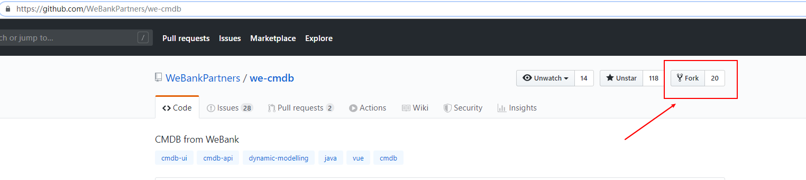
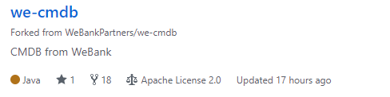
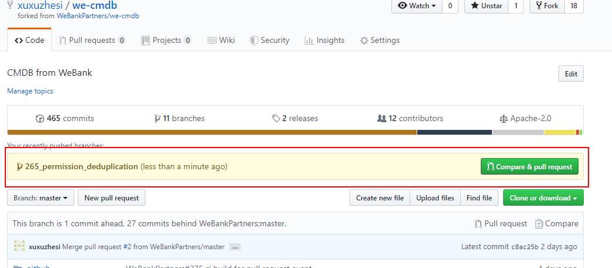
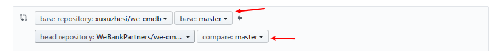

# WeCMDB Contributor Guide

## Fork project

Enter we-cmdb repository，click `fork` on the right, create a copy of the we-cmdb project as your own project.


## Edit your code

As you can see from the figure below, we-cmdb project is already in your github repository. It can also be found that github also indicates the source of the repository.



Now You can modify or add files in the repository, you can do this online or download the code repository to the local.

This guide takes the example of developing code locally.

relevant commands as follows:
```shell script
# create myRepositories directory
mkdir myRepositories

# switch to myRepositories directory
cd myRepositories  

# create and initialize the git repository
git init  

# add the remote git repository
git remote add origin https://github.com/xuxuzhesi/we-cmdb.git

# download remote git repository to the local directory
git pull origin master  
```

   
	
## Submit code
#### Edit the code locally, then upload the modified code to github repository, relevant commands as follows:

```shell script
#Will add all files under the current directory myRepositories to the local repository
git add .

#Submit changes
git commit -am 'Commit Explanation'

#Upload the repository to github
git push -u origin master 	
```

		
After uploading, go back to the github website and you can see what you just submitted:



####  How to Submit your changes
Submit the changes to the original author of the main account, who will decide whether to merge your changes, as follows, click on `Compare & Pull request`, then jump to the next page.

Click **“New pull Request”**


The source author in the master account will receive your submission request, and if possible, will merge your pull request with the trunk.


## Keep in sync with the original author

In the process of synchronization, you will see the changes submitted by others, which is one of Github's greatest value. To keep up with the original author, you should pull the code again.

If you have any update, modify the source branch and target branch, send a pull request.
	

	

	

