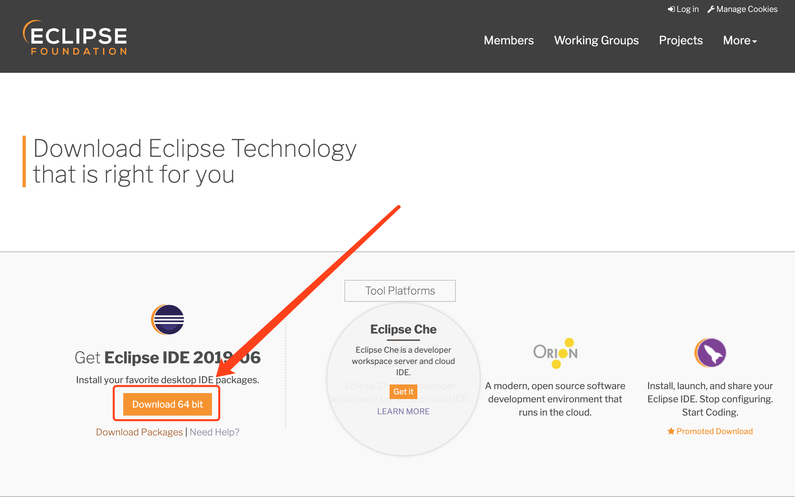
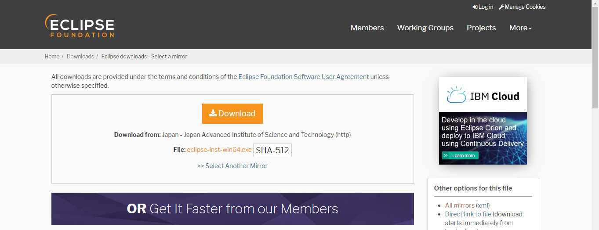
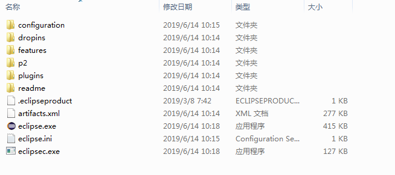
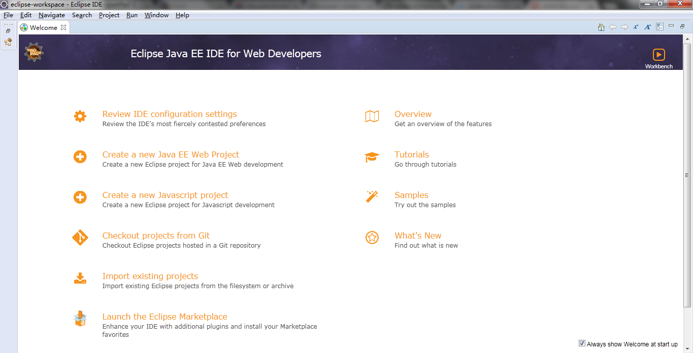

#eclipse install guide

##安装JDK
需要在开发电脑上先安装JDK，请参考[JDK安装文档](jdk_install_guide.md)

## 下载Eclipse
打开以下链接：
	
	https://www.eclipse.org/home/index.php
进入Eclipse官网。

点击“Download”，进入下载页。

点击“Download 64bit”，

下载软件

本文以安装eclipse-jee-2019-06-R-win32-x86_64为例。

## 安装Eclipse
1. 解压
	
	下载完成之后，解压安装包，解压路径随意，打开解压好的eclipse文件夹，选中eclipse.exe文件，在桌面创建快捷方式，Eclipse的安装完成。

	

2. 双击eclipse.exe运行
	
	配置工作区目录	
	
	
	启动成功
	

