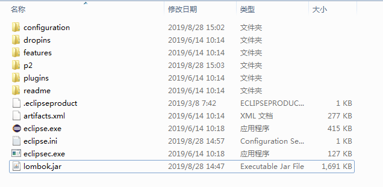
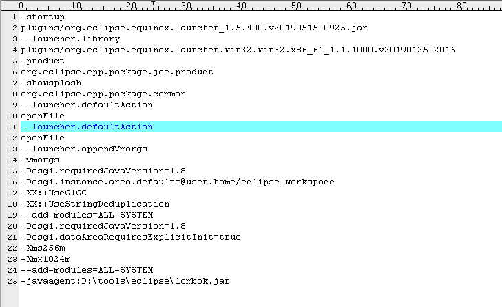

# Eclipse Install Guide

## Install JDK
PLease refer to [JDK install guide](https://github.com/WeBankPartners/we-cmdb/blob/master/cmdb-wiki/docs/developer/jdk_install_guide_en.md) on how to install JDK.

## Download Eclipse

Open the following link:
	
	https://www.eclipse.org/home/index.php
to access eclipse official website, click "Download" to enter the download page.


Click “Download 64bit”


Download Eclipse


This guide takes the installation of eclipse-jee-2019-06-R-win32-x86_64 as an example.

## Installation
1. Unpacking the install package
	
	Extract the installation package as follows

	

2. Double clikck eclipse.exe to start eclipse
	
	Select a directory as workspace
	
	
	
	Startup Successfullt

	

3. Add lombok.jar plugin
	
	Download `lombok.jar` from `https://projectlombok.org/download`.
	
	Save `lombok.jar` to the eclipse installation directory.

	

	Edit the file `eclipse.ini` and add a new line:
	
	```
	-javaagent:D:\tools\eclipse\lombok.jar
	```

	Note: `D:\tools\eclipse\lombok.jar` Is the absolute path to the lombok.jar file.

	

	Restart eclipse.
