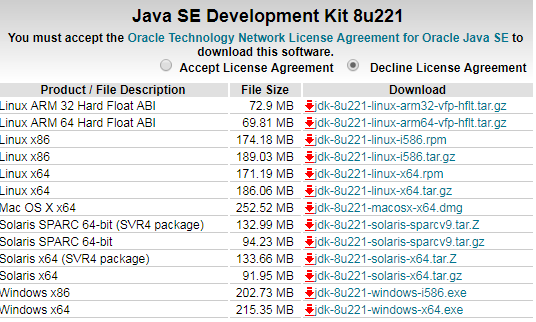
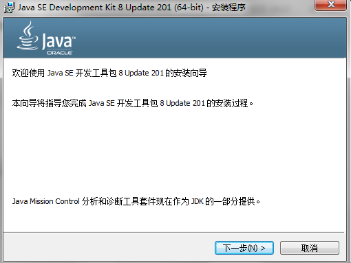
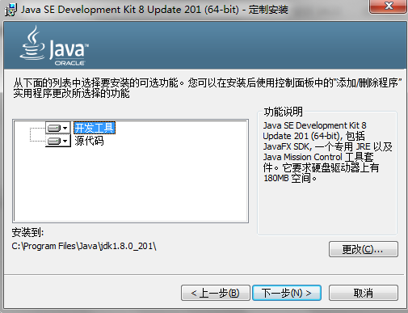
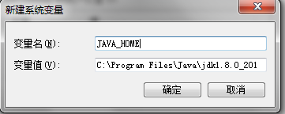
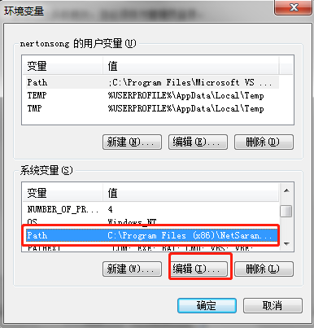
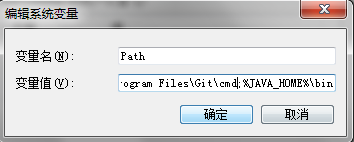
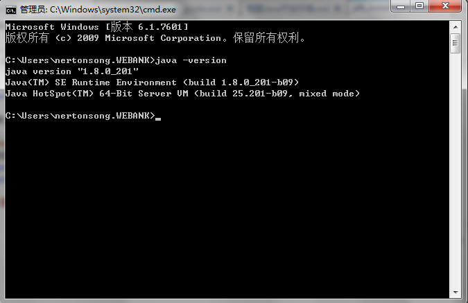

# JDK Install Guide

## Download JDK
Open the following link:
	
	http://www.oracle.com/technetwork/java/javase/downloads/jdk8-downloads-2133151.html

to access JDK1.8 download page, download according to your needs

This guide takes the installation of jdk-8u201-windows-x64 as an example.

## Install JDK
Double click to install, as shown below:

Uses the default configuration, until the installation is complete.

## Environment variable configuration
1. Right click on "My Computer (Computer) --> Properties" on the desktop, open the Control Panel and select "Advanced System Settings".
	
	

2. Select "Advanced --> Environment Variable" in "System Properties"
	
	

3. Find "System Variables" in the "Environment Variables" panel and select "New".
	
	

4. In the "New System Variables" dialog box, enter "JAVA_HOME" in the variable name field, and find the installation path of jdk in the variable value.
	
	

5. Find the "path" variable in "System Variables" and click "Edit" when selected.
	
	

6. At the end of the variable value line, type: ";%JAVA_HOME%\bin"
	
	

	At this point the environment variable has been configured.

## Check

Run CMD (Win+R or the bottom right corner of the start menu entry), in the expanded command line window, execute command `java –version`.

If the output shown java version info, the jdk installation is successful.

