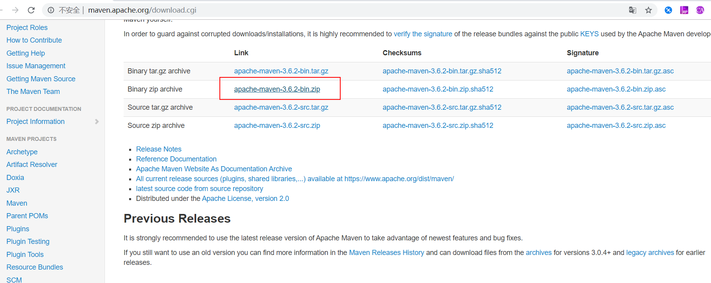
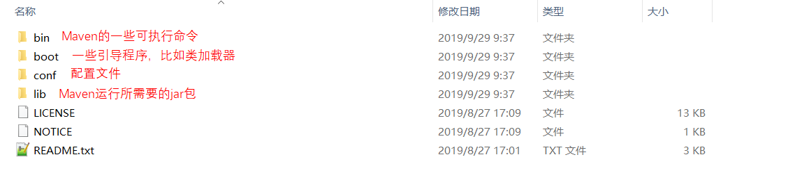
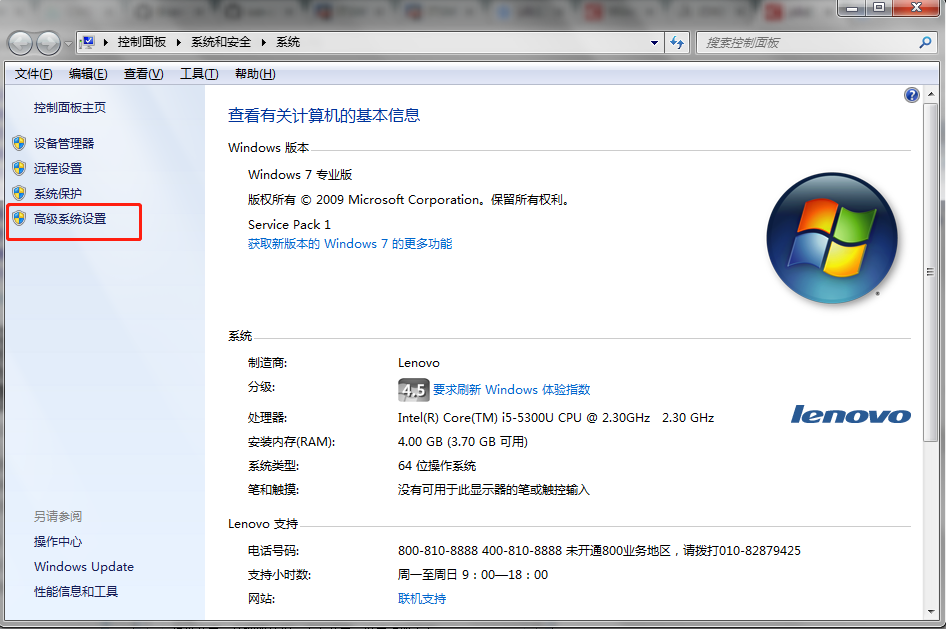
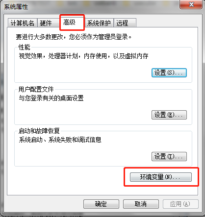
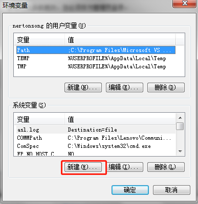
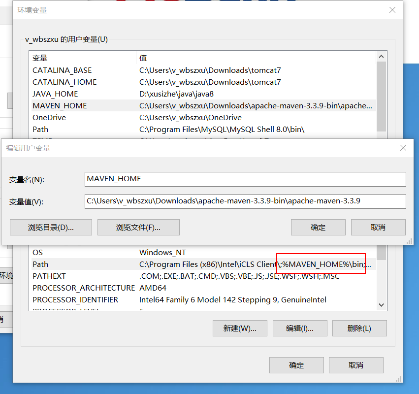

# Maven Install Guide

## Maven Download
Open the following link:
	
	http://maven.apache.org/download.cgi
Go to Maven to download the official website.

Enter the official website, according to their own needs to download, Windows system download binary zip package can be.

 

## Maven install
Installation - extract can be careful not to extract under the Chinese path

## Configure maven environment variables
1. Right-click on my computer -> properties on the desktop, open the control panel, and select advanced system Settings。
	

2. Select "advanced -> environment variable" from "system properties"
	

3. In the environment variables panel, go to system variables and select new.
	

4. In the "new system variables" dialog box, enter "MAVEN_HOME" in the name of the variable. The value of the variable finds the installation path of the JDK and fills it in.
	
	

5. Then find the "path" variable in "system variables", select it, and click "edit".
	

6. At the end of the variable value line type :"; %MAVEN_HOME%\bin", must be in English.
	

	Then confirm it. At this point the environment variables are configured.

## Maven check

Run CMD (Win+R or the input of the start menu in the lower right corner), enter mvn-v or mvn-version in the expanded command line window, and output as shown in the figure below will show that Maven has been successfully installed.

## Maven repository
1. Local repository: used to store the plug-ins and jars downloaded from the remote repository or the central repository. The project USES some plug-ins or jars. Priority is given to finding the default local repository from the local repository at ${user.dir}/.m2/repository. Local repositories can be configured in the Maven installation directory -conf-settings.xml.

2. Remote repository: if a plug-in or jar is needed locally, which is not available in the local repository, download it from the remote repository by default. Remote repositories can be either over the Internet or over a local area network.

3. Central repository: in maven software built-in a remote warehouse address in http://repo1.maven.org/maven2, it is a central repository, service on the Internet, it is by maven team maintenance, stored inside a very full of jars, it contains the world's most popular open source project artifacts.

