# Mysql Install Guide

## Download the installation package

Open the following link:
	https://dev.mysql.com/downloads/mysql/
to access eclipse official website,
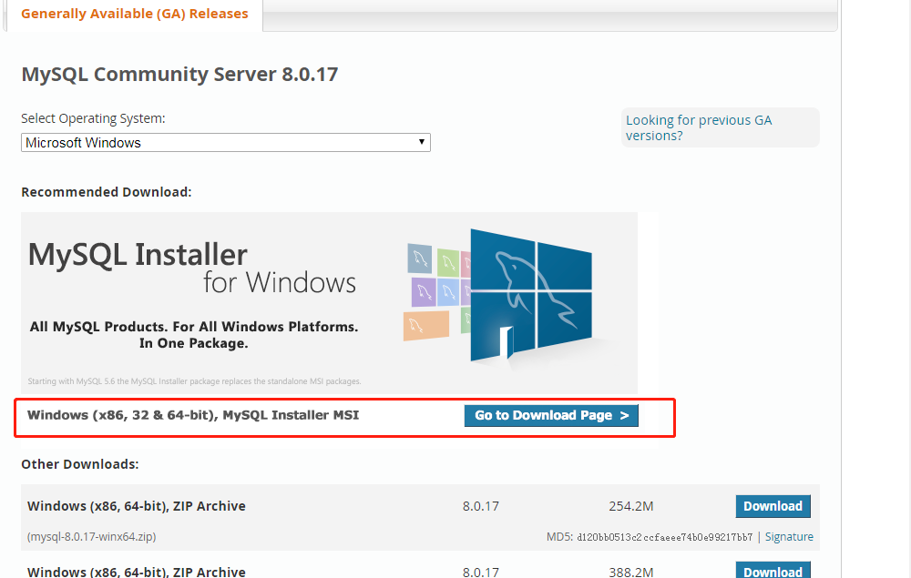

, click the link to enter the download page.
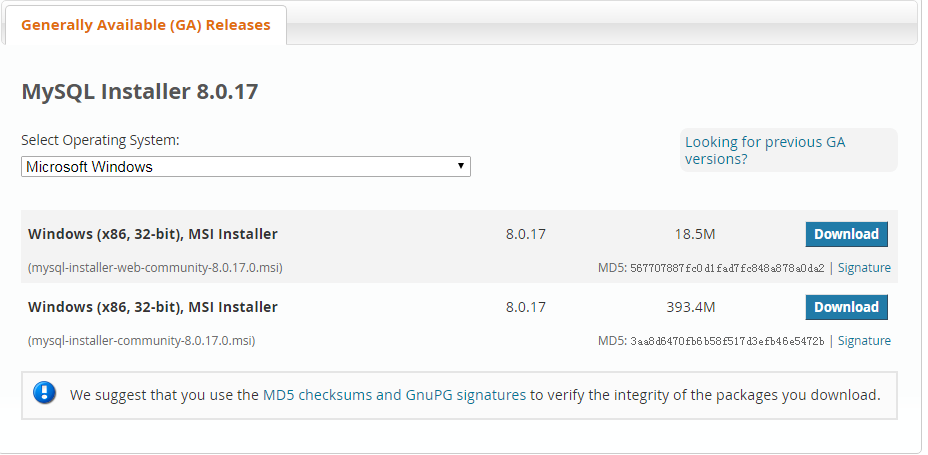

This guide takes the installation of mysql-installer-community-8.0.17.0.msi as an example.

## Installation
1. Double click to install, as shown below:
	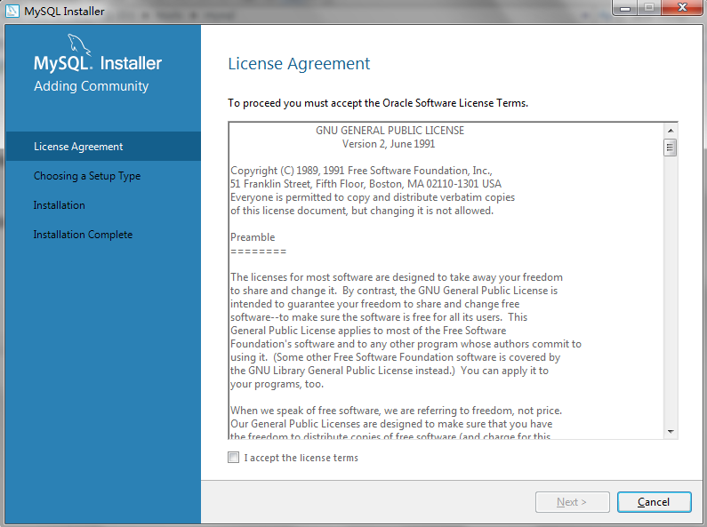

2. Agree to the license agreement, the next step
	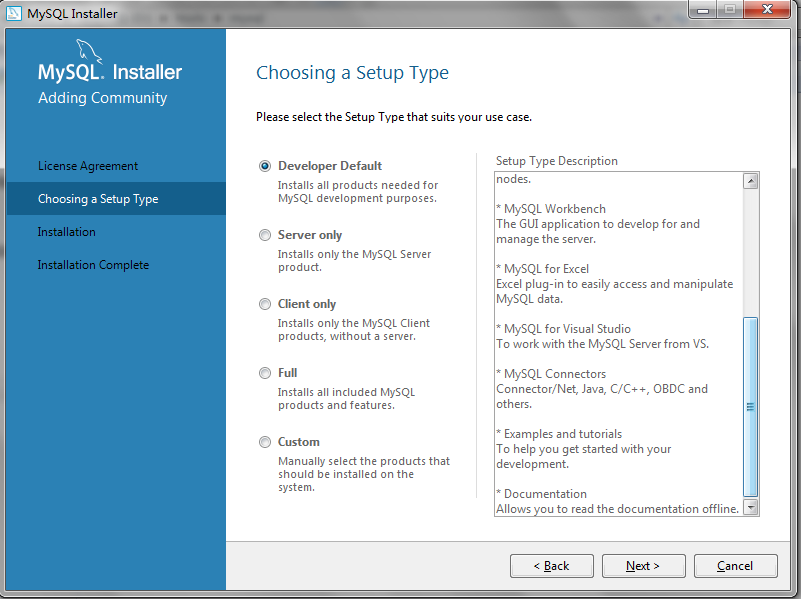

3. Default, next step
	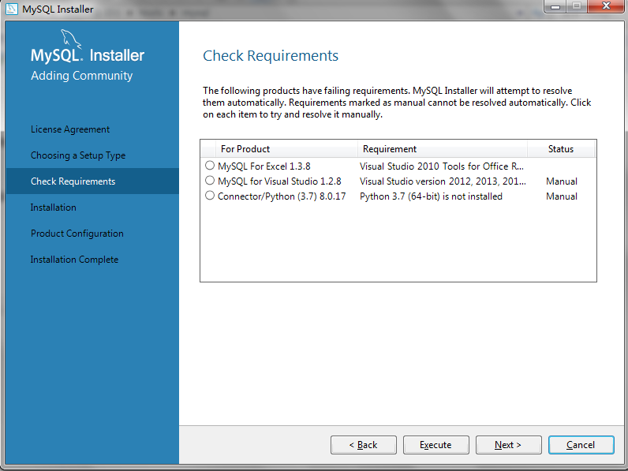

4. Next step
	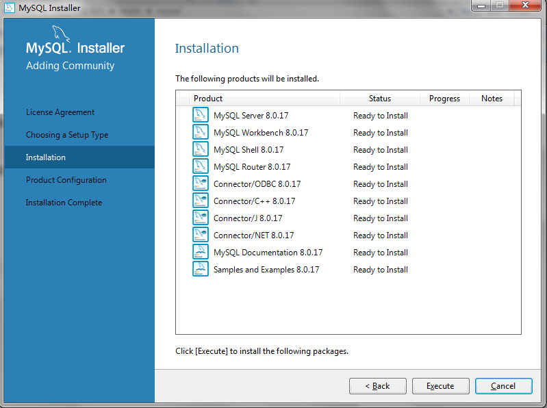

5. Click `Execute`, wait for the installation to complete, next step
	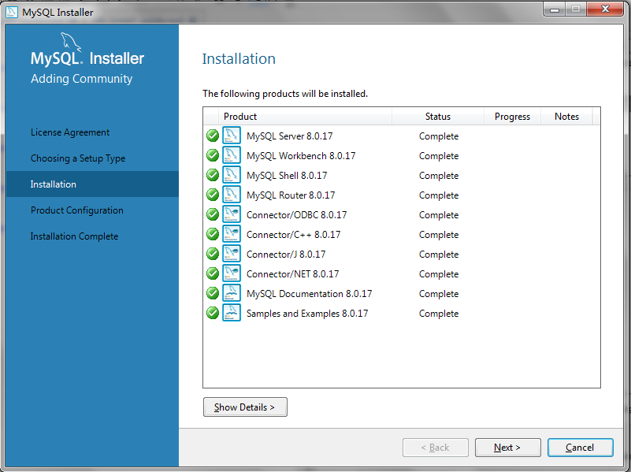

6. Configuration, next step
	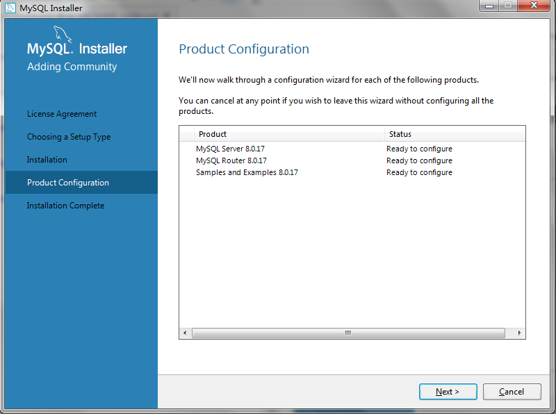

7. Mysql Server Configuration
	Enter Mysql Server Configuration Page
	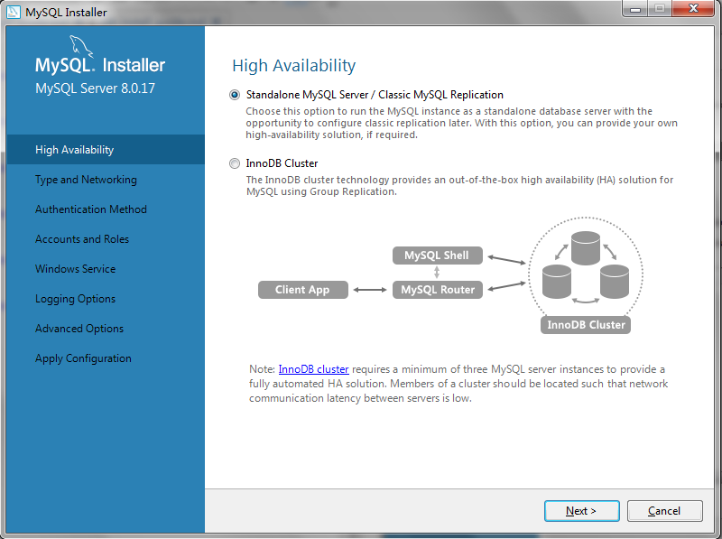

	In the Mysql Server configuration step, configure all defaults, set the password of the root account, until the configuration is complete, click to execute
	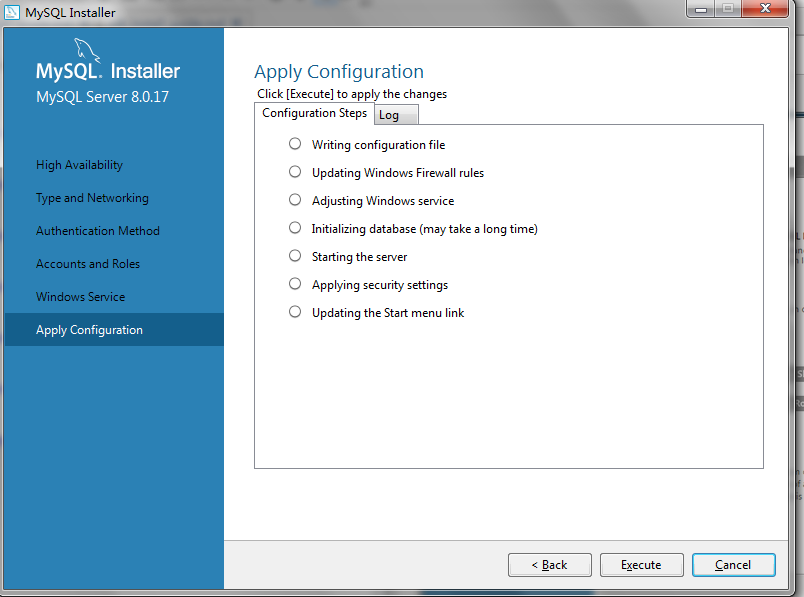

	Mysql Server Configuration complete
	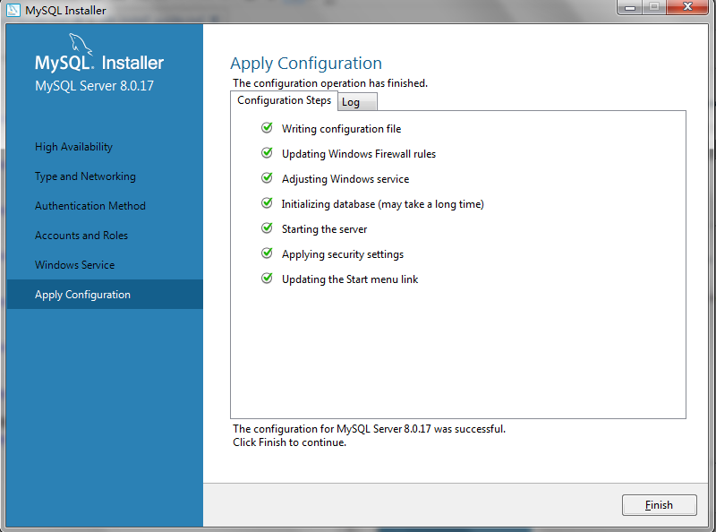

8. Mysql Router Configuration
	

	Default configuration, click to complete
	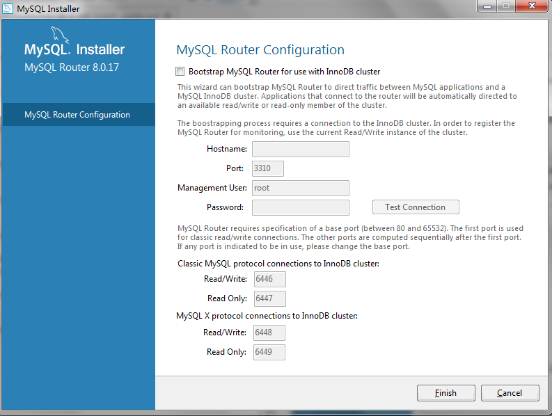

9. Mysql Router Configuration
	

	Enter the password of the root user just set, click `check`, test the connection is successful, the next step
	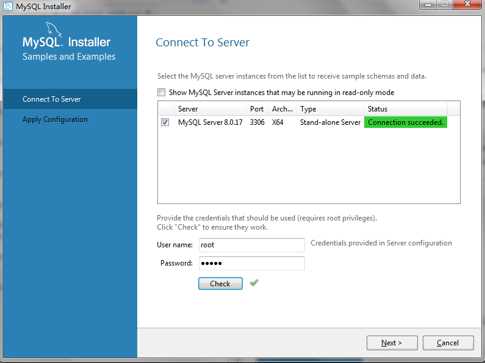

	Click `Execute`, then click `Finish`.
	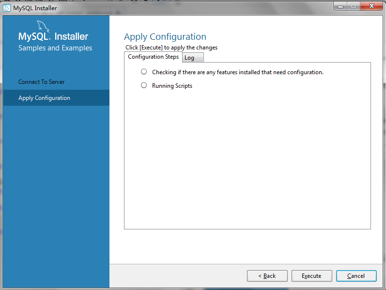

10. back to the Install Page
	
	
	Click `Next`, then click `finish`
	

11.Installation Complete
	After the installation is complete, the command line and workbench interface are automatically opened.

	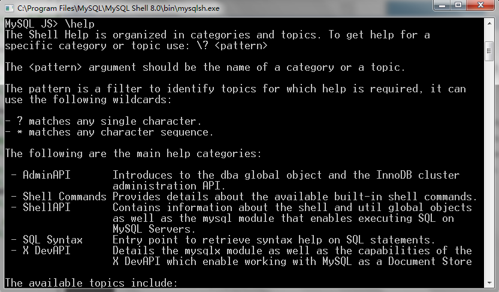
	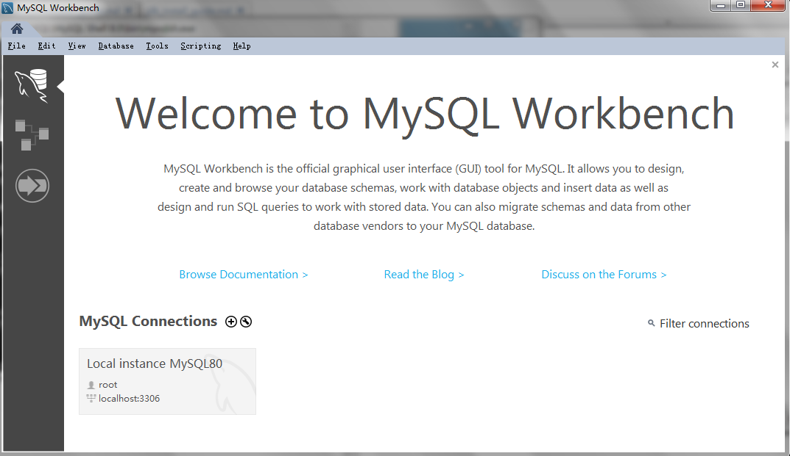
	

## Check

1. In the workbench interface, choose `local instance`
	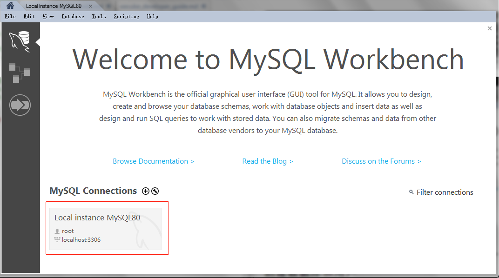

2. Enter the management interface to view service status, client connections, user permissions, and more.
	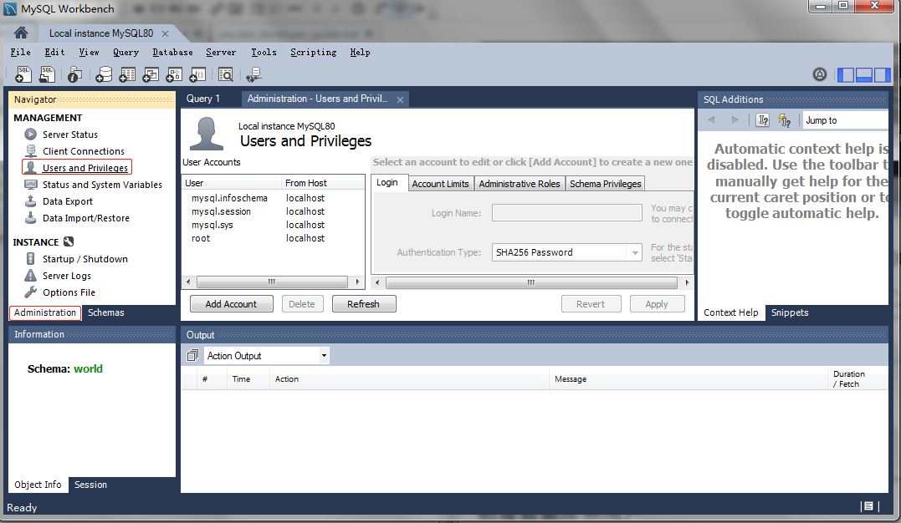

3. View the current schema list as follows
	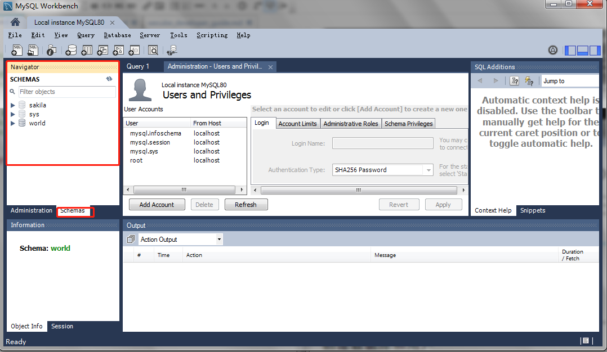
