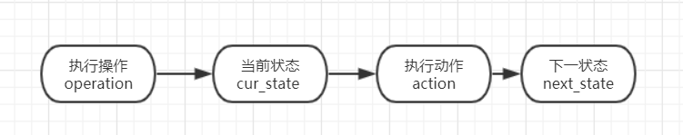
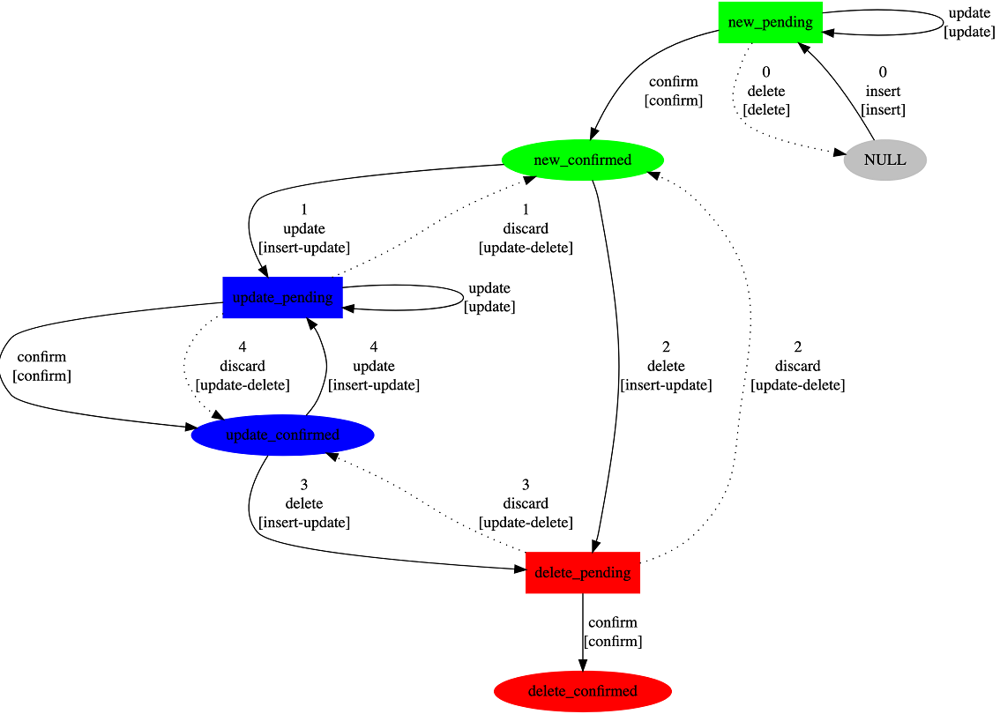
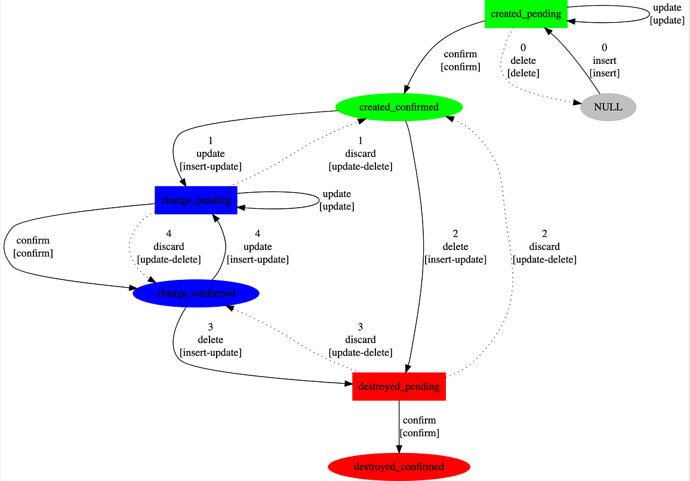
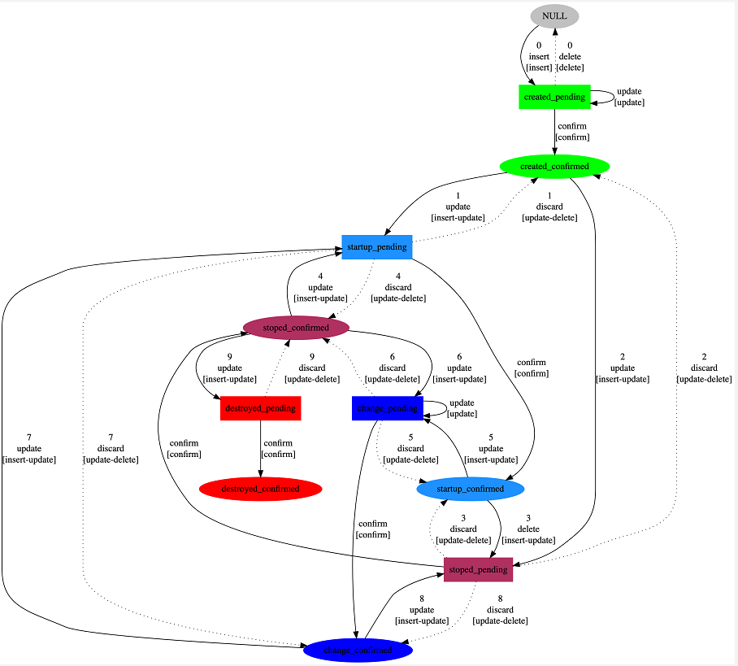

# CMDB状态机说明
有限状态机FSM思想广泛应用于硬件控制电路设计，也是软件上常用的一种处理方法(软
件上称为FMM--有限消息机)。它把复杂的控制逻辑分解成有限个稳定状态，在每个状态
上判断事件，变连续处理为离散数字处理，符合计算机的工作特点。同时，因为有限状
态机具有有限个状态，所以可以在实际的工程上实现。

## 原理
                       		

> 如上图，发生事件(event)后，根据当前状态(cur_state)，决定执行的动作(action)，并设置下一个状态号(nxt_state)。
事件、当前状态、动作、下一个状态都在数据库配置，可更改

### 模型
CMDB系统具有三套状态机模型:
- 设计类CI状态
- 可创建类CI状态
- 可起停类CI状态

#### 设计类CI状态
设计类CI状态模型有三种状态：new(新增)、update(修改)、delete(删除),每种状态又分为pending、confirm两类，状态之间转换如下图：

- 当触发一个新增事件(新增一条数据)时，数据状态从null->create_pending,create_pending可以执行delete(删除操作，状态变为null)、update(更新操作状态不变)、confirm(确定操作，状态改为create_confirm)。状态为create_confirm时，可执行confirm(确定操作，状态修改为confirm)、update/discard(更新/取消操作，状态在pending和confirm间转换)、delete(删除操作，状态更改为delete_pending),当状态为delete时，可执行discard操作回退到删除前的状态，还可以confirm(确认删除)。其余模型类似

#### 可创建类CI状态
设计类CI状态模型有三种状态：created(新增)、change(修改)、destroyed(删除),每种状态又分为pending、confirm两类，状态之间转换如下图：

#### 可起停类CI状态
设计类CI状态模型有三种状态：startup、startup、destroyed、update(修改)、delete(删除),每种状态又分为pending、confirm两类，状态之间转换如下图：

### 使用
cmdb选用该模型的配置项如下：
##### 设计类CI状态如下·
CI:系统设计、子系统设计、单元设计、服务设计、调用设计、调用时序设计、数据中心节点、安全区域连接设计、安全区域连接设计、数据中心节点设计、资源集设计

##### 可创建类CI状态模型的配置项如下：
CI:系统、单元、服务、调用、包、块存储、IP、机房、安全区域、安全您系监测本职、安全区域连接，数据中心节点、资源集、网段
##### 可起停类CI状态模型的配置项如下：
CI:主机、运行实例
