# WeCMDB Developer Guide

## Preparation
1. Java SE Development Kit (JDK)
	
	PLease refer to [JDK install guide](https://github.com/WeBankPartners/we-cmdb/blob/master/cmdb-wiki/docs/developer/jdk_install_guide_en.md) on how to install JDK.

2. Eclipse
	
	PLease refer to [Eclipse install guide](https://github.com/WeBankPartners/we-cmdb/blob/master/cmdb-wiki/docs/developer/eclipse_install_guide_en.md) on how to install Eclipse.

3. Mysql
	
	PLease refer to [Mysql install guide](https://github.com/WeBankPartners/we-cmdb/blob/master/cmdb-wiki/docs/developer/mysql_install_guide_en.md) on how to install Mysql.

4. Node.js
	
	Download node.js v10.16.3 from `http://nodejs.cn/download`. Double-click the downloaded installation file to install it by default configuration.


## Import the project
   You can pull the code directly from git, or you can pull the code project to the local and then import it into Eclipse. This article takes local import as an example.

1. Import the project
	
	Choose to import an existing project
	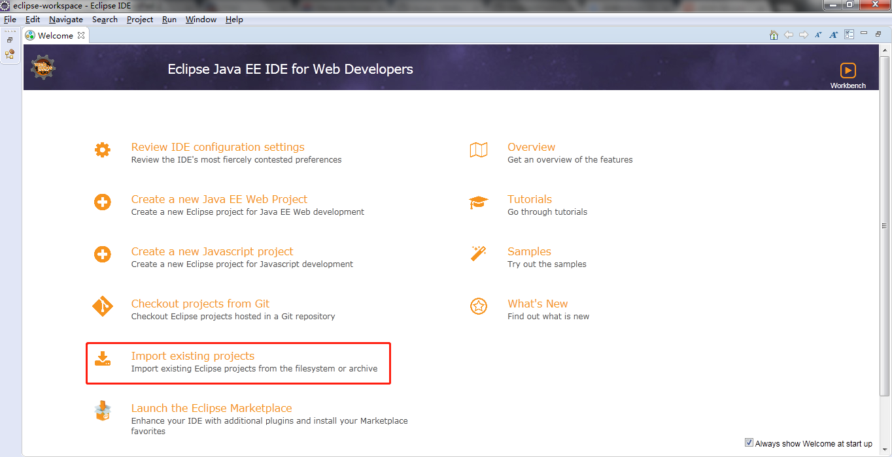
	
	Choose an existing maven project
	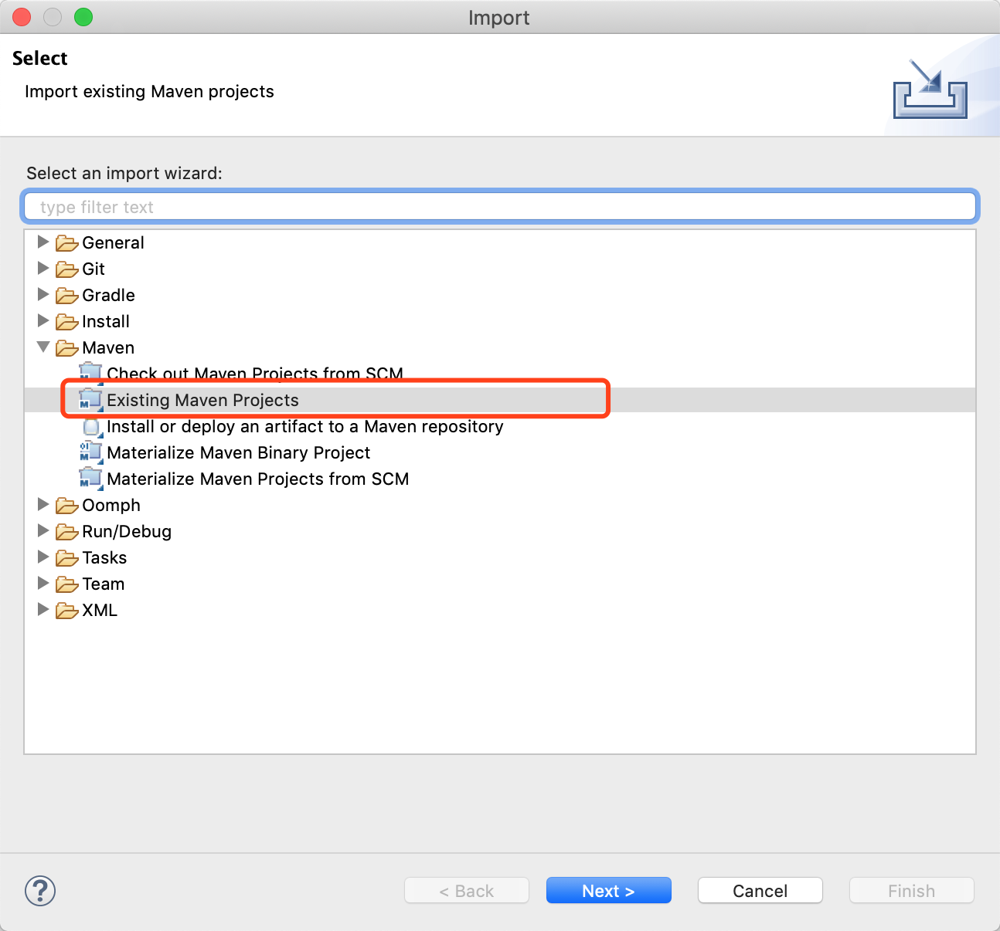
	
	Select the code directory of wecmdb as the root directory 

	
	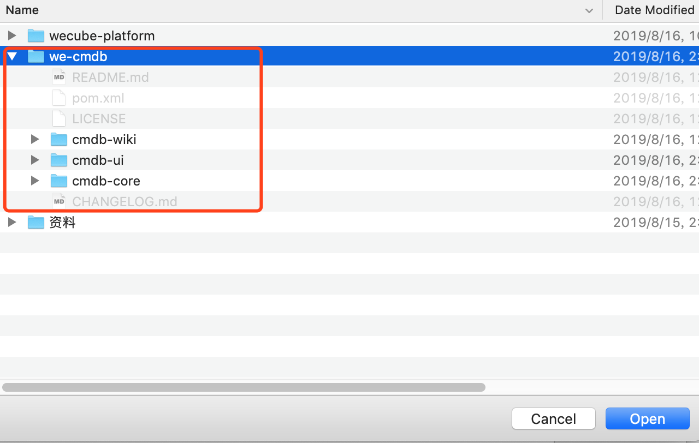
	
	Confirm and complete the import.
	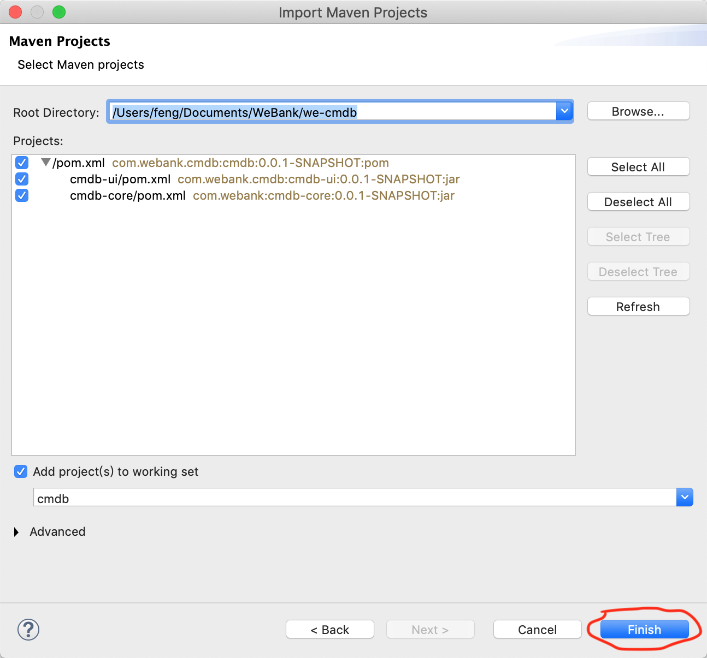
	
	After the project is imported, the dependencies and compilations are automatically downloaded. Make sure the network connection is normal.

2. Switch view
	
	After the project is imported, open the menu *Window > Show View*, choose *Project Explorer*
	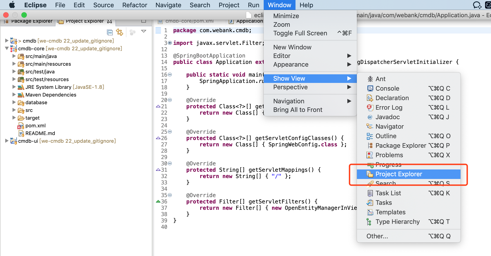

3. Customize Spring configuration

	In *Project Explorer* view，copy *application-local.yml* and rename as *application-dev.yml*
	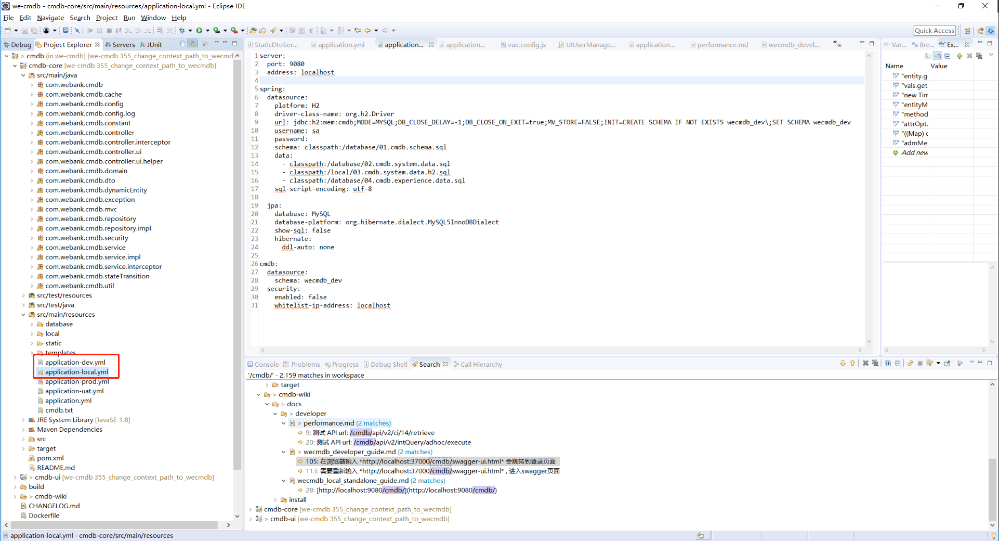
	
	Edit *application-dev.yml* ，Modify the relevant configuration, without CAS in development mode, you can remove the CAS related configuration.
	
	*application-dev.yml* sample as follows：


	```
    server:
      port: 9080
      address: localhost
    
    spring:
      datasource:
        platform: H2
        driver-class-name: org.h2.Driver
        url: jdbc:h2:mem:cmdb;MODE=MYSQL;DB_CLOSE_DELAY=-1;DB_CLOSE_ON_EXIT=true;MV_STORE=FALSE;INIT=CREATE SCHEMA IF NOT EXISTS wecmdb_dev\;SET SCHEMA wecmdb_dev
        username: sa
        password:
        schema: classpath:/database/01.cmdb.schema.sql
        data:
          - classpath:/database/02.cmdb.system.data.sql
          - classpath:/local/03.cmdb.system.data.h2.sql
          - classpath:/database/04.cmdb.experience.data.sql
        sql-script-encoding: utf-8
    
      jpa:
        database: MySQL
        database-platform: org.hibernate.dialect.MySQL5InnoDBDialect
        show-sql: false
        hibernate:
          ddl-auto: none
    
    cmdb:
      datasource:
        schema: wecmdb_dev
      security:
        enabled: false
        whitelist-ip-address: localhost
	
	```

	If you want to use MYSQL database, sample as follows:
	```
    server:
      port: 9080
      address: localhost
    
    spring:
      datasource:
        driver-class-name: com.mysql.cj.jdbc.Driver
        url: jdbc:mysql://localhost:3306/wecmdb_dev?characterEncoding=utf8&serverTimezone=Asia/Shanghai
        username: root
        password: 
    
      jpa:
        database: MySQL
        database-platform: org.hibernate.dialect.MySQL5InnoDBDialect
        show-sql: false
        hibernate:
          ddl-auto: none
    
    cmdb:
      datasource:
        schema: wecmdb_dev
      security:
        enabled: false
        whitelist-ip-address: localhost
	```
	If your MYSQL database is empty, you can run the following SQLs to initialize your database: 
	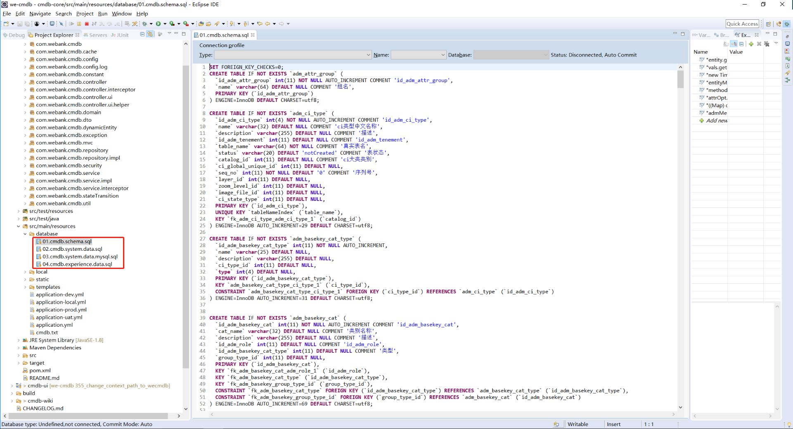

4. Start WeCMDB backend
	
	Open Window->Preferences， choose Java->Installed JREs，add new jdk config as follows:
	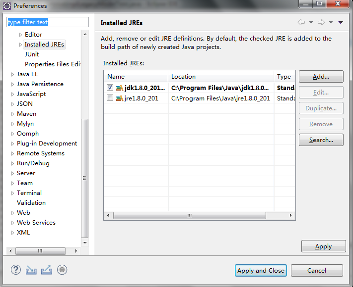

	Download dependencies, compile, as follows：

	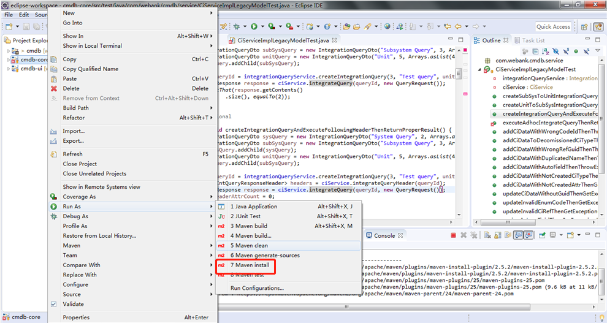
	
	Start service

	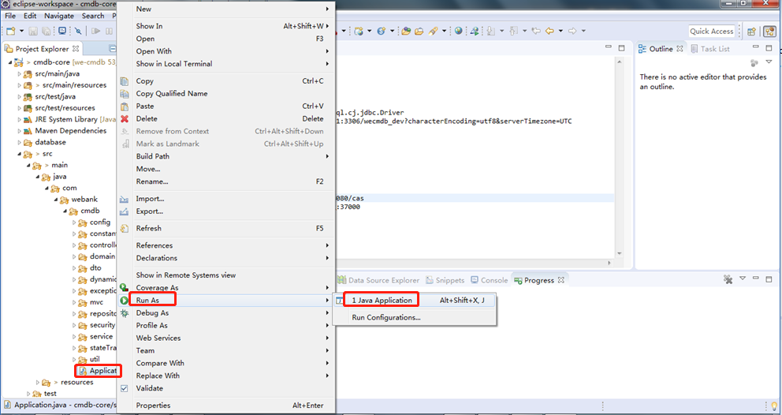
	
	Enter the following url in the browser  *http://localhost:9080/wecmdb/swagger-ui.html* Will redirect to the login page

	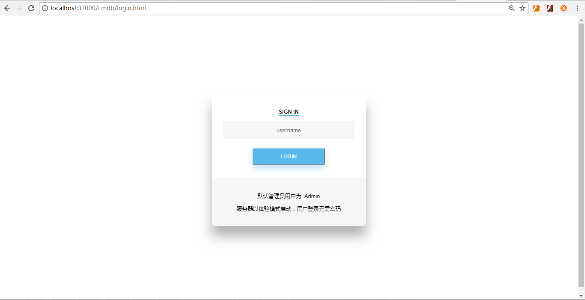

	Confirm after entering the user, will be redirected to the home page

	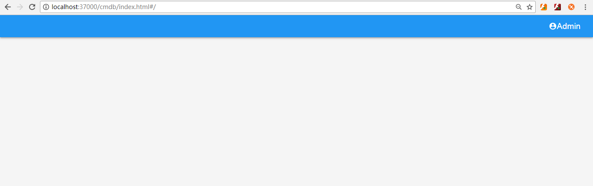

	Enter the following url again in the browser  *http://localhost:9080/wecmdb/swagger-ui.html* , Go to the swagger page

	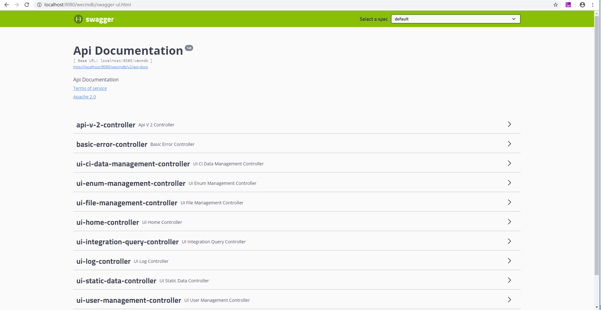


6. Start WeCMDB frontend
	
	Run CMD (Win+R or the bottom right corner of the start menu entry), in the expanded command line window, enter the we-cmdb code subdirectory wecmdb-ui.

	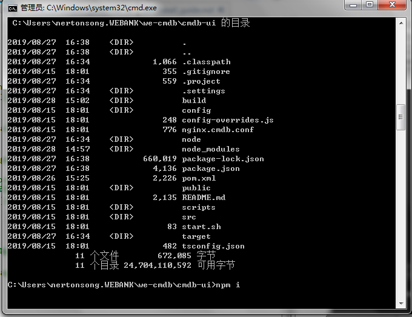
	
	Install npm
	
	```shell script
	npm install
	```
	
	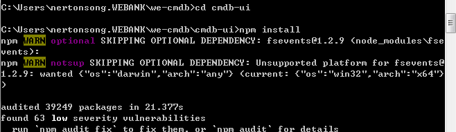

	After the installation is complete, execute the command

	```shell script
	npm start
	```

	as follows：

	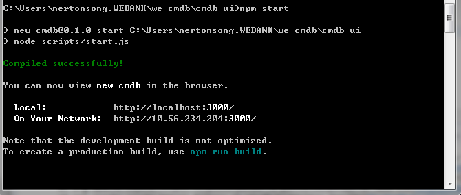

	Service started, open *http://localhost:3000*, go to the WeCMDB home page

	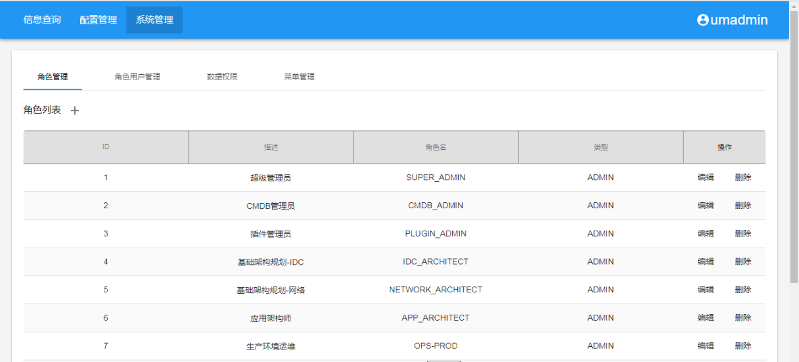