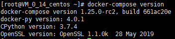

# Docker-compose Install Guide

## Before installation
1. one Linux host, this installation guide uses the virtual machine on Tencent Cloud as an example.
2. The operating system version is recommended to be centos7.2 or higher, the recommended kernel version is 3.10.517 or higher.
3. The network needs to be able to access internet(need to download and install the software from internet).
5. install docker1.17.03.x or higher
	- PLease refer to [docker install guide](https://github.com/WeBankPartners/we-cmdb/blob/master/cmdb-wiki/docs/install/docker_install_guide_en.md) on how to install docker.

The following installation and configuration operations are performed under the root user.

## Installation
1. Download docker-compose

	```
	curl -L https://github.com/docker/compose/releases/download/1.25.0-rc2/docker-compose-`uname -s`-`uname -m` -o /usr/bin/docker-compose
	```

2. Modify docker-compose execution authority

	```
	chmod +x /usr/bin/docker-compose
	```

3. check docker-compose command

	```
	docker-compose --version
	```

	