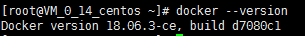

# Docker Install Guide

## Before installation
This installation guide uses the virtual machine on `Tencent Cloud` as an example.

1. Linux host with the Internet connection.
2. CentOS 7.2+ is preffered.
3. Kernel version should be 3.10.517 or higher.

The following installation and configuration operations are performed under the root user.


## Installation
1. Download the install package

	```
	mkdir  /data/
	cd /data
	wget https://download.docker.com/linux/static/stable/x86_64/docker-18.06.3-ce.tgz
	```

2. Unpacking the install package

	```
	tar xzvf docker-18.06.3-ce.tgz
	mv docker/* /usr/bin
	```

3. Create directory `/etc/docker`，create config file `/etc/docker/daemon.json`, detailed as follows

	```
	{
	  "bip": "10.0.0.1/28",
	  "bridge": "",
	  "debug": false,
	  "default-runtime": "runc",
	  "exec-opts": [],
	  "exec-root": "",
	  "graph": "/var/lib/docker",
	  "group": "",
	  "insecure-registries": [],
	  "ip-forward": true,
	  "ip-masq": true,
	  "iptables": true,
	  "ipv6": false,
	  "labels": [],
	  "live-restore": true,
	  "log-driver": "json-file",
	  "log-level": "warn",
	  "log-opts": {
	    "max-file": "10",
	    "max-size": "100m"
	  },
	  "registry-mirrors": [
	    "https://mirror.ccs.tencentyun.com"
	  ],
	  "runtimes": {},
	  "selinux-enabled": false,
	  "storage-driver": "overlay2",
	  "storage-opts": [
	    "overlay2.override_kernel_check=true"
	  ]
	}
	
	```

4. Create docker service file `/lib/systemd/system/dockerd.service`, detailed as follows

	```
	[Unit]
	Description=dockerd
	
	[Service]
	Environment=QCLOUD_NORM_URL=
	Type=notify
	ExecStart=/usr/bin/dockerd --config-file=/etc/docker/daemon.json
	ExecStartPre=/bin/rm -f /var/run/docker.pid
	ExecStartPost=-/sbin/iptables -I FORWARD -s 0.0.0.0/0 -j ACCEPT
	ExecReload=/bin/kill -s HUP $MAINPID
	LimitNOFILE=1048576
	LimitNPROC=1048576
	LimitCORE=infinity
	TimeoutStartSec=0
	Delegate=yes
	KillMode=process
	Restart=always
	RestartSec=10
	
	[Install]
	WantedBy=multi-user.target
	```

5. Create the service and start

	```
	systemctl enable dockerd
	systemctl start  dockerd
	```

6. Run the following command to confirm that docker is successfully installed
	
	```
	docker --version
	```
	


## Set linux kernel parameters

1. Edit config file `/etc/sysctl.conf` as follows

	```
	net.ipv4.ip_forward=1
	net.bridge.bridge-nf-call-ip6tables = 1
	net.bridge.bridge-nf-call-iptables = 1
	```

2. Execute the command as follows
	
	```
	sysctl -p
	```
