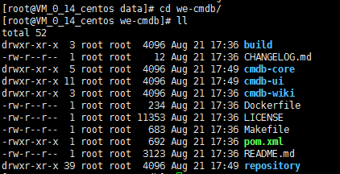
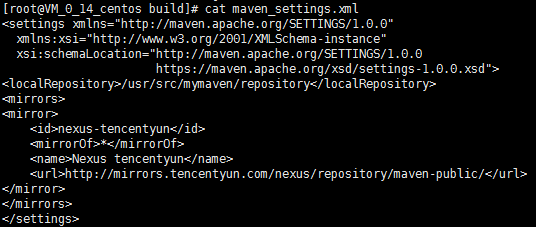
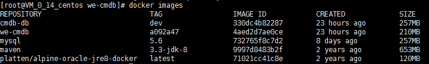

# WeCMDB Compile Guide

## 编译前准备
1. 准备一台linux主机，为加快编译速度， 资源配置建议4核8GB或以上；
2. 操作系统版本建议为ubuntu16.04以上或centos7.3以上；
3. 网络需要可通外网(需从外网下载安装软件)；
4. 安装Git
	- yum安装 
	```
 	yum install -y git
 	```
	- 手动安装，请参考[git安装文档](git_install_guide.md)

5. 安装docker1.17.03.x以上
	- 安装请参考[docker安装文档](docker_install_guide.md)


## 编译过程
1. 通过github拉取代码

	切换到本地仓库目录， 执行命令 
	
	```
	cd /data	
	git clone https://github.com/WeBankPartners/we-cmdb.git
	```

	根据提示输入github账号密码， 即可拉取代码到本地。
	拉取完成后， 可以在本地目录上看到we-cmdb目录， 进入目录，结构如下：
	

2. 编译

	maven配置文件在build目录下的maven_setting.xml文件,默认配置如下:
	

	编译过程中会从外网拉取maven包和npm包，如果有更快的maven源，可修改该文件中的配置。

	在代码目录下执行make build 等待编译完成。

3. 制作镜像
	
	在代码目录下执行make image，将制作WeCMDB的运行镜像。
	如果还需要制作WeCMDB的数据库镜像，进入build/db目录，执行以下命令：
	```
	chmod +x build-image.sh
	./build-image.sh
	```
	镜像制作完成后， 执行命令：
	```
	docker images
	```
	
	可查看镜像列表
	
	
4. 镜像保存
	
	执行以下命令将镜像保存到linux目录：
	
	```
	docker save -o wecmdb-app.tar we-cmdb
	docker save -o wecmdb-db.tar cmdb-db
	```
	可在当前目录下看到保存成功的文件，将镜像文件发送到部署机器， 即可开始部署。
	也可以将镜像上传到远程镜像仓库， 部署时从远程镜像仓库拉取。