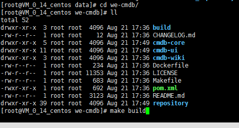
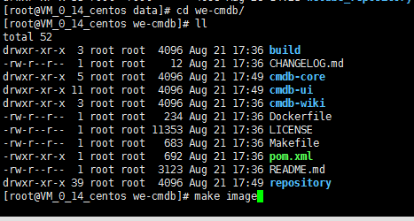

# WeCMDB Compile Guide


## Before compilation
1. Linux host with the Internet connection, we recommend a server with 4 cores, 8GB or more memory for better compilation speed.
2. Ubuntu 16.04+ or CentOS 7.3+ is preferred.
3. Git
	- CentOS
        ```shell script
        yum install -y git
        ```
	- For other OS version, please refer to [git install guide](https://github.com/WeBankPartners/we-cmdb/blob/master/cmdb-wiki/docs/install/git_install_guide_en.md) on how to install manually.

4. Docker 1.17.03.x
	- Please refer to [docker install guide](https://github.com/WeBankPartners/we-cmdb/blob/master/cmdb-wiki/docs/install/docker_install_guide_en.md) on how to install docker.


## Compiling and Packaging
1. Download source code from github

	Switch to the local repository directory and execute the commands:
	
	```shell script
	cd /data	
	git clone https://github.com/WeBankPartners/we-cmdb.git
	```

	Enter the github account username and password as prompted, and you can pull the source code to the local.

	After that, enter the wecmdb directory and the structure is as follows:

	

2. Compilation

	The maven configuration file is in the maven_setting.xml file in the build directory. The default configuration is as follows:

	

	During the compilation process, the maven package and the npm package will be pulled from the external network.
	 
	You can customize your maven profile if there is a faster maven source in your region.

	Execute the following command in the root of the code:

    ```shell script
    make build
	```
	
	Waiting for compilation to complete, as follows：

	

3. Build images
	
	After compilation is complete, Execute the following command in the root of the code:

    ```shell script
    make image
	```
	
	as follows：

	

	Start to make WeCMDB's runtime image.

	If you still need WeCMDB's database image, execute the command as following：

	```shell script
	cd build/db
	chmod +x build-image.sh
	./build-image.sh
	```

	After all images is made, execute the commands：

	```shell script
	docker images
	```
	
	Will show you the image lists:
	
	
	
4. Save images
	
	Execute the following commands to save the image to linux local directory：
	
	```shell script
	docker save -o wecmdb-app.tar we-cmdb
	docker save -o wecmdb-db.tar cmdb-db
	```

	In the current local directory, you can see the saved files, send the image file to the deployment machine, and start deploying.

	The image can also be uploaded to the remote mirror repository and pulled from the remote mirror repository during deployment.