 # WeCMDB User Guide
[toc]
## 主菜单介绍
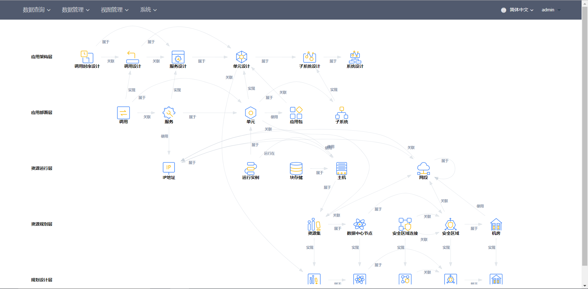
CMDB的功能分为四大菜单：系统、数据管理、数据查询，视图查询。下面详细介绍每个菜单下的每个功能。

## 系统
系统管理包括CMDB模型管理、日志查询、基础数据管理、系统权限管理。
### CMDB模型管理
CMDB模型管理页面以图形化方式展示了各CI之间的关系，并可以新增、编辑及删除各CI及其属性。
[点此](wecmdb_model_guide.md)详细了解CMDB模型。

1. 点击左上角加号，可以新增层。
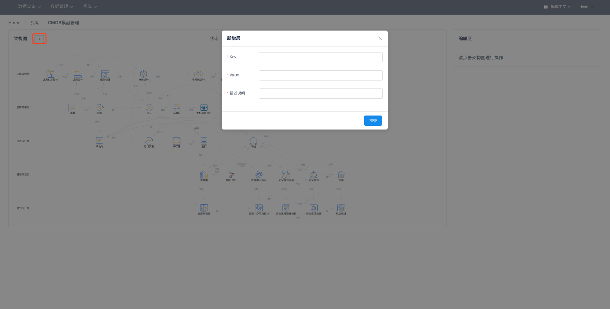
2. 上方下拉框可以根据状态过滤模型图中的CI。

3. 点击任意层节点，右侧展示该层的所有CI，并且可以新增/编辑/删除CI，编辑层名称，上移/下移层，删除层。

4. 点击任意CI节点，右侧展示该CI的所有属性，并且可以新增/编辑/删除CI属性，编辑CI名称，上移/下移，ci属性。
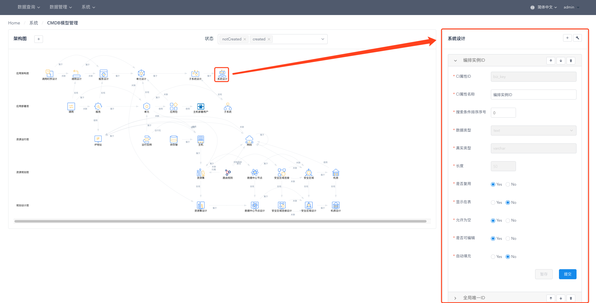
5. 鼠标悬停在CI节点上，可高亮该CI的所有关联关系，滚轮向上滚动可放大模型图，滚轮向下滚动可缩小模型图。

### 系统权限管理
系统权限管理展示了用户、角色、菜单权限及数据权限之间的对应关系。

1. 用户管理

- 点击*用户名*如*admin*可以显示该用户所属的所有角色，并展示这些角色拥有的菜单及数据权限。

- 点击用户栏上方*添加用户*按钮可以增加新用户。

2. 角色管理

- 点击*角色名*如*超级管理员*可显示该角色下的所有用户，并展示该角色拥有的菜单及数据权限。

- 点击角色栏上方*添加角色*按钮可以增加新角色。
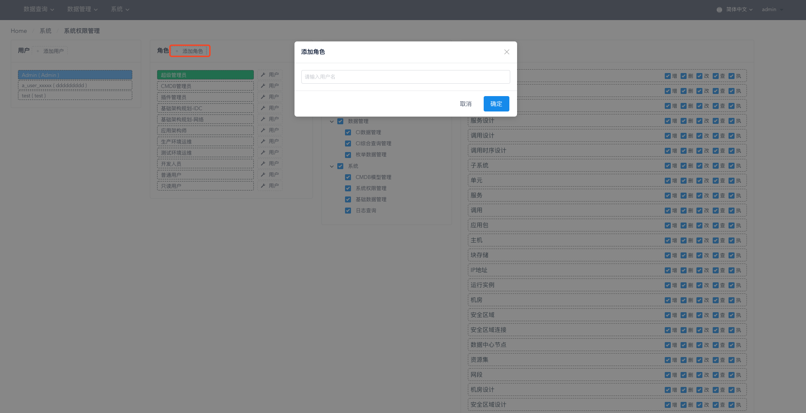
- 点击角色名后*用户*按钮可以对该角色下的用户进行添加和清除。

3. 菜单权限及数据权限管理

- 点击*角色名*如*超级管理员*，可以看到该角色下的菜单及数据权限，点击复选框可以添加/删除对应菜单/数据权限。
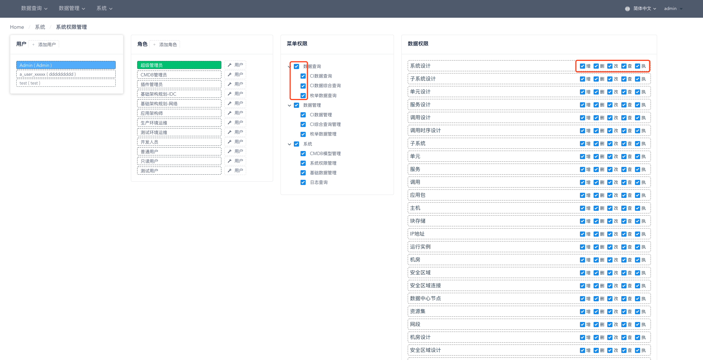

### 日志查询
1. 日志查询作为审计和追溯用途， 提供对系统中所有操作的日志检索，支持查询维度：操作用户、操作时间， 操作功能，操作CI， 操作内容， 操作结果等。
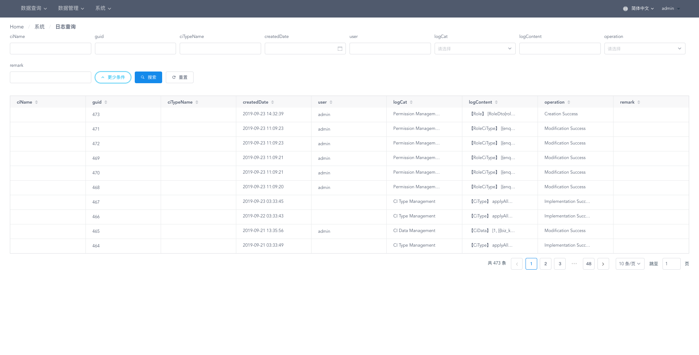

### 基础数据管理
1. 基础数据管理页面可以对系统枚举进行增删改查。
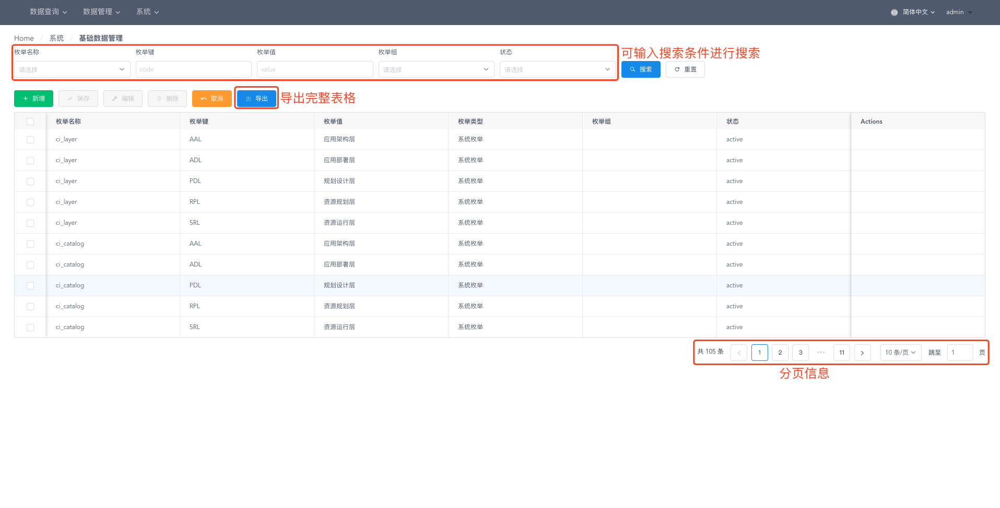

## 数据管理
配置管理包括CI数据管理、CI综合查询管理、枚举数据管理

### CI数据管理
1. 打开CI数据管理页面，可以看到cmdb模型图，该图只展示created与dirty状态的ci,鼠标悬停于某个CI上时，展示该CI相应的关联关系。
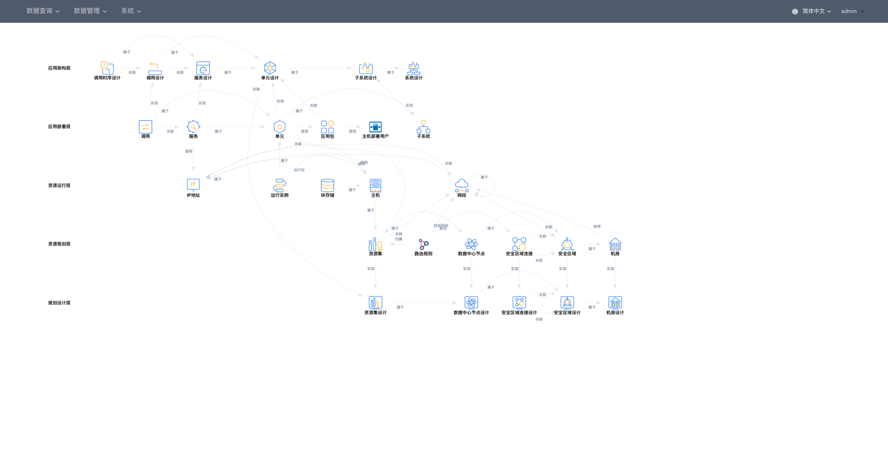
2. 点击CI进入数据管理页面，操作可参考[基础数据管理](#dataBase)页面。

### CI综合查询管理
1. 选择综合查询后，可以查看该综合查询所包含的CI及他们的关系。
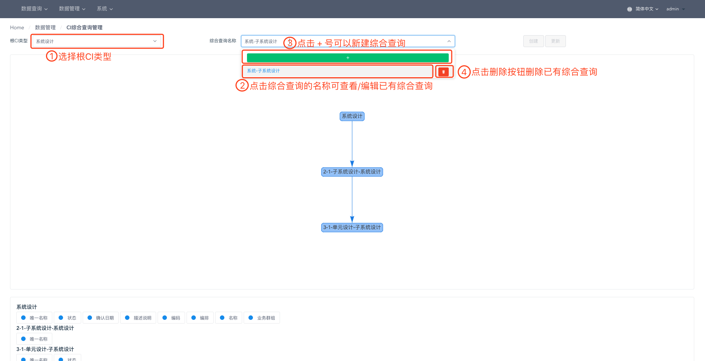
2. 点击图上的一个CI节点，可以看到*属性*、*引用*、*被引用*三个页签。勾选的属性会展示在页面下方，勾选的引用及被引用CI会展示为图上的一个节点。
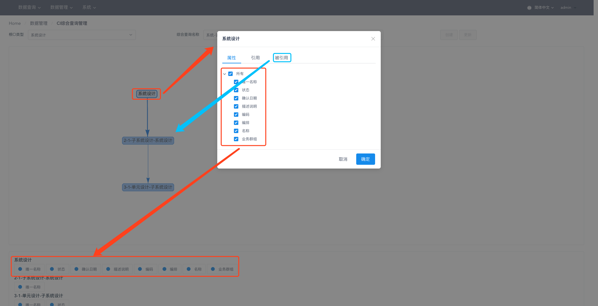

### 枚举数据管理
1. 枚举数据管理页面可以查询并对公有枚举/私有枚举进行增删改查，操作可参考[基础数据管理](#dataBase)页面。

## 数据查询
数据查询包括CI数据查询、CI数据综合查询、枚举数据查询

### CI数据查询
1. 打开CI数据查询页面，可以看到cmdb模型图，该图只展示created与dirty状态的ci,鼠标悬停于某个CI上时，展示该CI相应的关联关系。
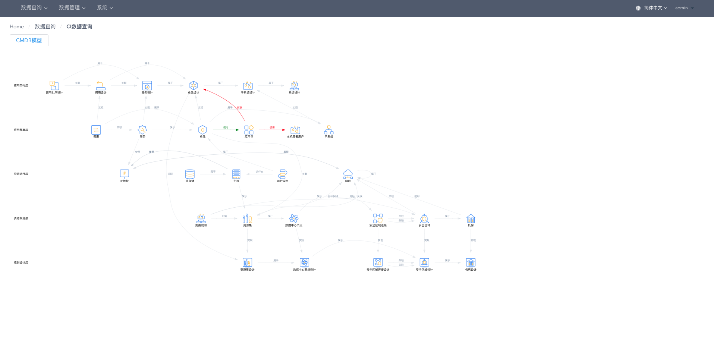
2. 点击CI进入数据查询页面，可以进行数据查询。
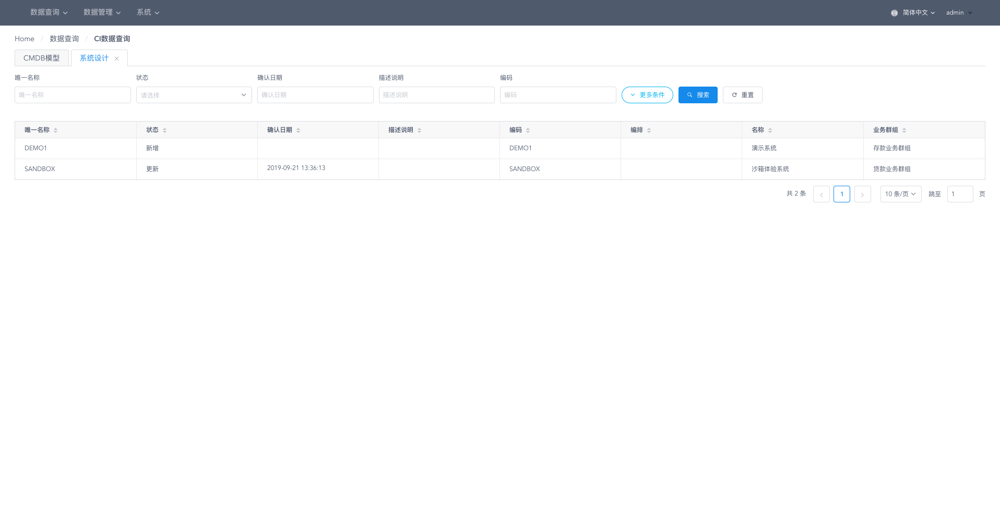

### CI数据综合查询
1. 选择根CI类型，选择综合查询名称进行综合数据查询。
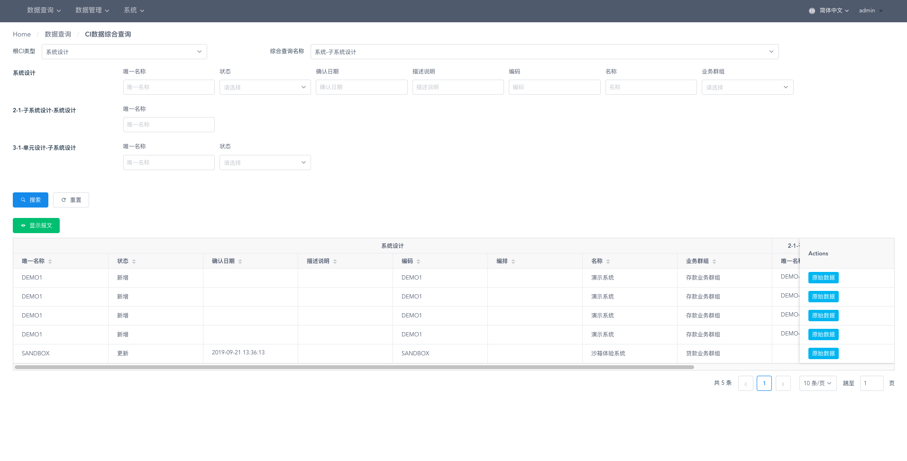
2. 点击*显示报文*可以查看该综合查询的*url*、*payload*、*result*。

3. 点击每条数据后面的*原始数据*可查看该条数据的详细信息。

### 枚举数据查询
1. 枚举数据查询页面可以查询并对公有枚举/私有枚举进行查询。

##视图管理

###IDC规划设计
1. 选择IDC，展示该IDC的规划设计图，滚动鼠标可放大缩小设计图。

1. 选择"IDC规划设计图"卡片旁边的任一个卡片，对该IDC下的任一规划项进行设计。
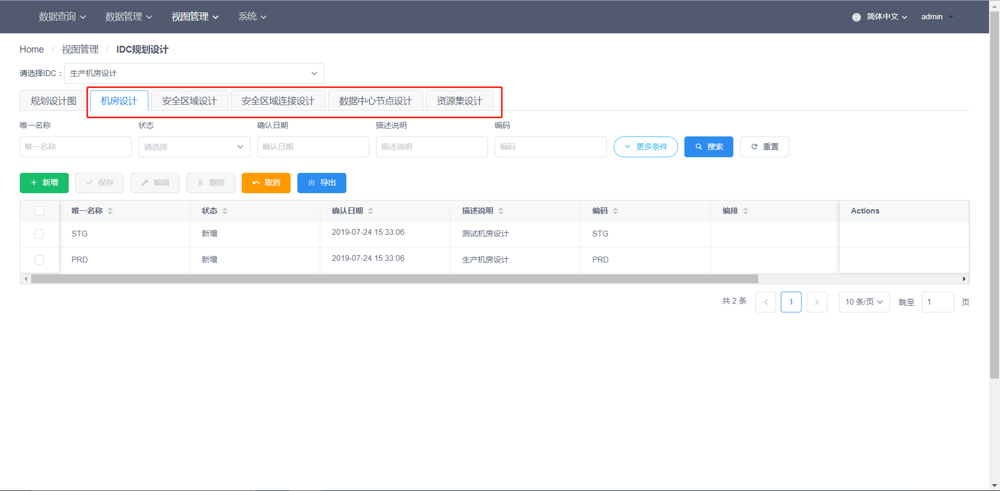

###IDC资源规划
1. 选择IDC，展示该IDC的资源规划图，滚动鼠标可放大缩小规划图。

1. 选择"IDC资源规划图"卡片旁边的任一个卡片，对该IDC下的任一资源进行规划。

###应用架构设计
1. 选择系统设计，展示该系统设计的应用架构设计图，滚动鼠标可放大缩小设计图。

2. 选择设计图右边的调用时序设计，点击确定，列出该系统设计的时序调用步骤，按左右箭头，可依次查看应用间的调用关系。
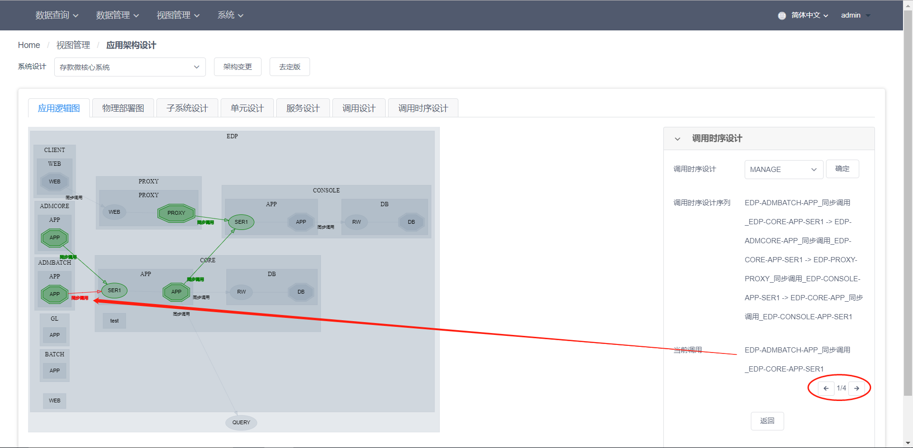
   
3. 选择"应用架构设计图"卡片旁边的"物理部署图"，浏览该系统设计的物理部署情况。
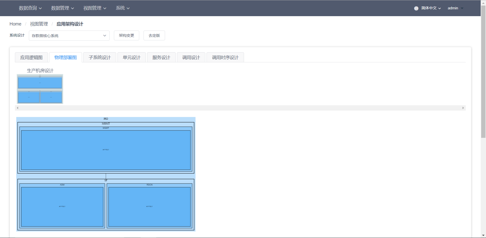

4. 选择"物理部署图"右边任一卡片，对该系统设计下的任一配置项进行设计，如时序设计：

###应用部署设计
1. 选择系统设计，展示该系统设计的应用部署设计图，滚动鼠标可放大缩小设计图。

2. 选择"应用部署设计图"卡片旁边的"应用树状逻辑图",展示该系统设计应用部署的树状视图，滚动鼠标可放大缩小视图。

3. 选择"应用树状逻辑图"卡片旁边的"物理部署图",展示该系统设计的应用部署图，滚动鼠标可放大缩小视图。
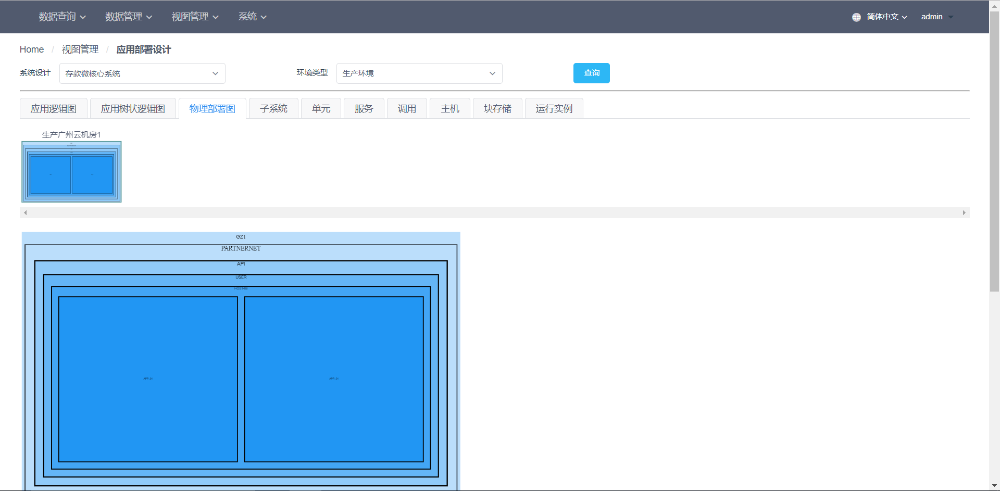

4. 选择"物理部署图"右边任一卡片,对该系统设计下的任一配置项进行配置：
