# WeCMDB User Guide

# Function menu

- [Main menu introduction](#menu_introduction)
- [System](#system)
  - [CMDB model management](#cmdb_model_management)
  - [System permission management](#permission_management)
  - [Log enquiry](#log_enquiry)
  - [Basic data management](#base_data_management)
- [Data management](#data_management)
  - [CI data management](#ci_data_management)
  - [CI integrated enquiry management](#ci_integrated_enquiry_management)
  - [Enum management](#enum_management)
- [Data enquiry](#data_enquiry)
  - [CI data enquiry](#ci_data_enquiry)
  - [CI data integrated enquiry](#ci_integrated_enquiry)
  - [Enum data enquiry](#enum_management)
- [View management](#view_management)

  - [IDC planning design](#idc_planning_design)
  - [IDC resource planning](#idc_resource_planning)
  - [Application architecture design](#app_arch_design)
  - [Application deployment design](#app_deploy_design)

## Main menu introduction

Function of WeCMDB can fall into four categories: system, data management, data enquiry, view enquiry. Below list the functionality of each menu in detail.

## System

System management is composed of CMDB data model management, log enquery, basic data management and System permission management.

### CMDB model management

CMDB data model management page illustrate the relationships between CIs, and provide functionality to add ,edit and remove each CI or its attributes.

[Click here](wecmdb_model_guide.md) to learn CMDB data model in detail.

1. Click the plus sign at top left corner, a new layer can be added.
   
1. CIs can be filtered and be displayed in the data model diagram according to the selected status in the top status drop-down list box.
1. 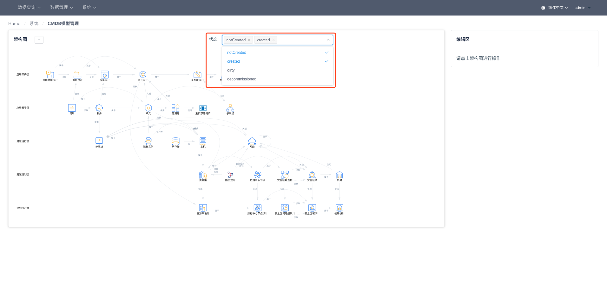
1. Click any layer node, all CIs of the clicked layer will be displayed. You also can add/edit/remove CIs, edit name of layer, move up/down or remove layers.
1. Click
   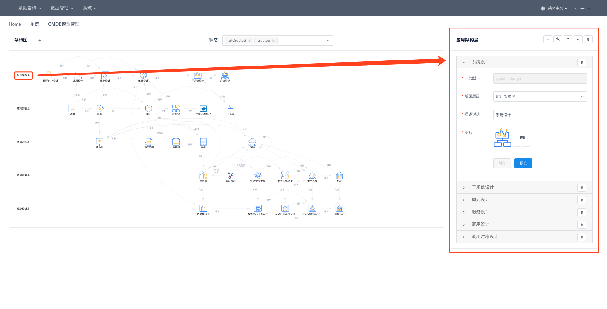
1. Click any CI node, all attributes of the clicked CI will be displayed on the right side, you also can add/edit/remove CI attributes, edit the name of CI, move up/down the CI attributse.
   
1. By hovering the mouse over a CI node, all relationship of the CI will be highlighted. Rolling the mouse wheel up can zoom in the diagram, instead, rolling wheel down can zoom out the diagram.

   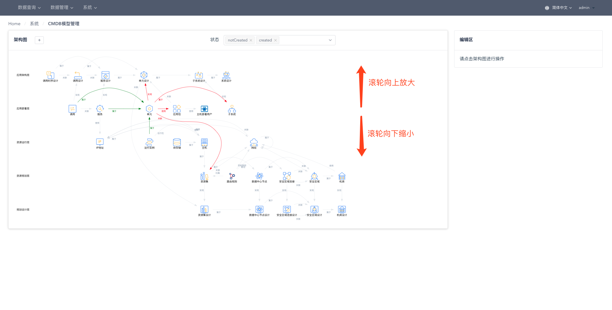

### System permission management

System permission management show the relationships among user,role, menu permission and data permission.
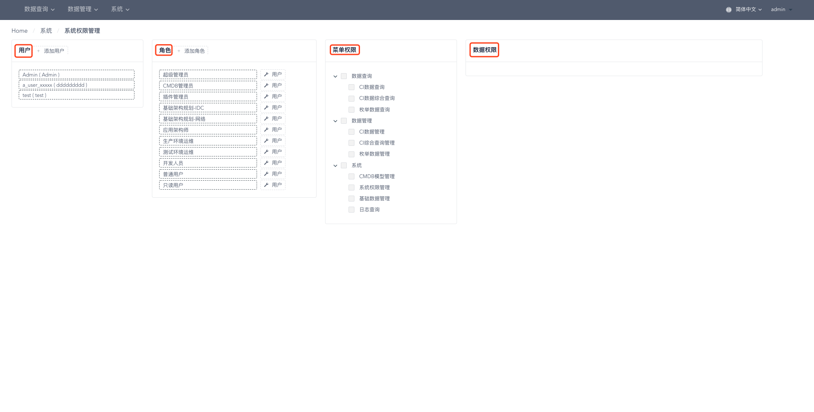

1. User management

- Clicking _user name_(e.g. admin) can show all roles the user belongs to, and display the menus and data permissions which those roles have.
  
- Clicking the _Add user_ button which is above user list can add new user.
  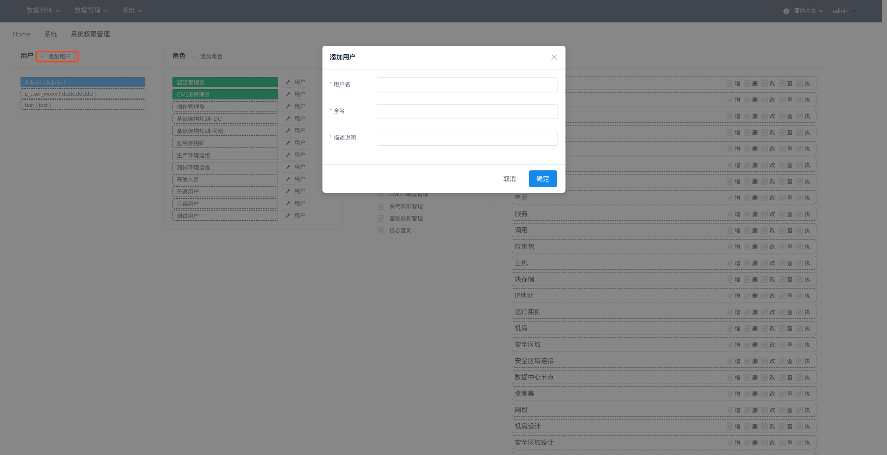

2. Role management

- Clicking a _role name_(e.g. super admin) can display all users belong to the role, and show all menus and data permissions which the role have.
  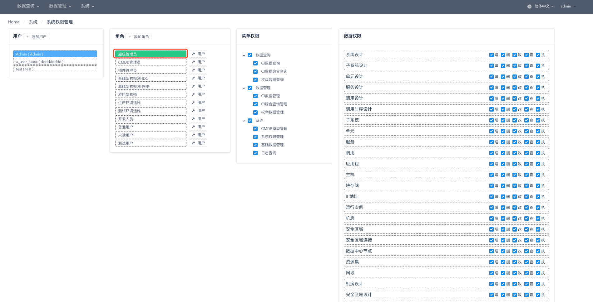
- Clicking _add role_ button above role list can add new role.
  
- Clicking _user_ button following role name can add or remove users for the role.
  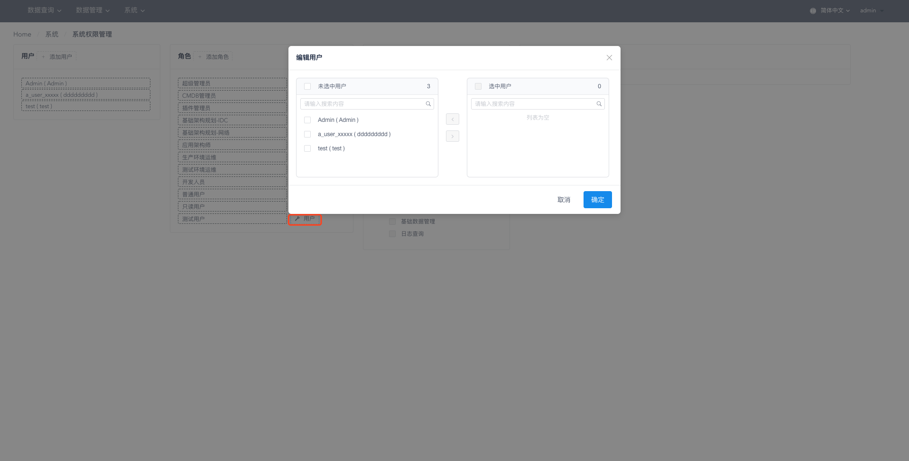

3. Menu permission and data permission management

- Clicking _role name_ (e.g. super admin) can display all menus and data permission belong to the role, clicking check boxes can add/remove according menu/data permission.
  

### Log enquiry

1. Log enquiry provide function of audit and trace, also it can be used to search any operation log of the system, supported search conditions: username, time, function, CI, content, result, etc.

   

### Basic data management

1. Basic data management page provide CRUD functionality for system enum data.
   
   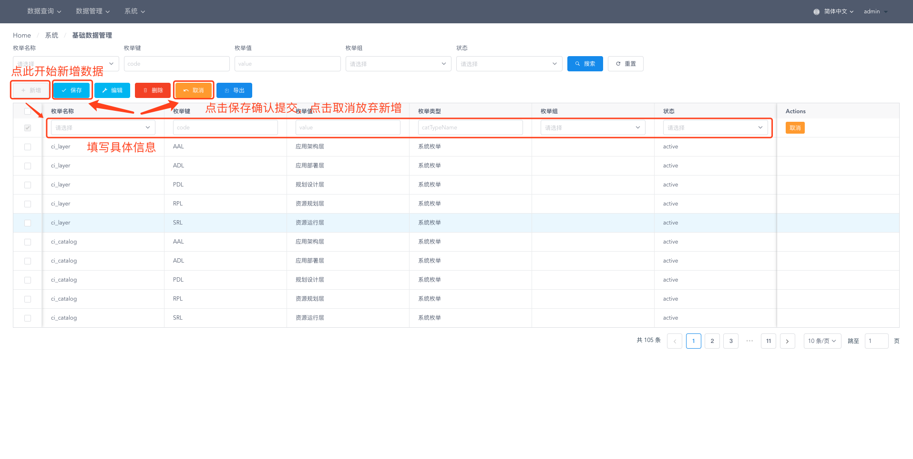
   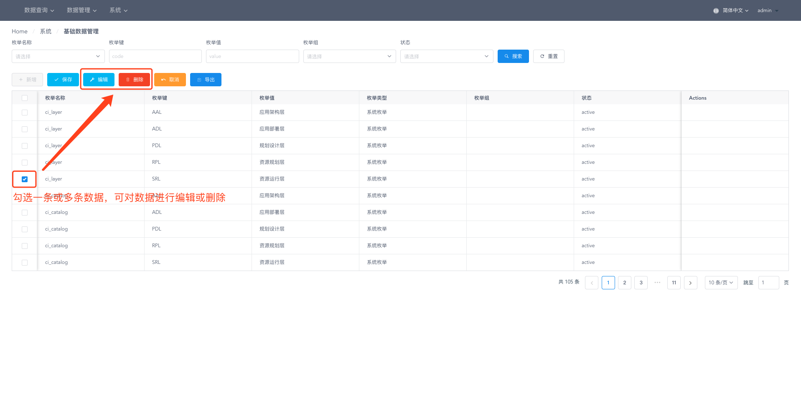

## Data management

Data management is composed of CI data management, CI integrated enquiry management, enum data management

### CI data management

1. After open CI data management page, CMDB data model diagram is displayed, the diagram just displays CIs which status are created and dirty. By hovering the mouse over a CI node, all relationship of the CI will be highlighted.

   

1. After click a CI and the data management page is opened, [Basic data management](#base_data_management) page can be referenced to operate.
   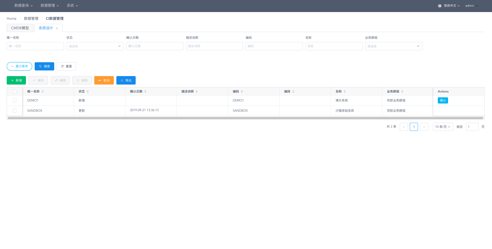

### CI Integrated enquiry management

1. After select a integrated enquiry, all CIs belong to the selected integrated enquiry and their relationships will be displayed.
   
1. After click a CI node in the diagram, 3 tabs (_Attribute_, _Reference_,_Being referenced_ ) will be displayed. The attributes which has been checked will be displayed at the bottom of the page, the referencing and being referenced CI will be displayed as node in the diagram.
   

### Enum data management

1. Enum data management page provide CRUD functionality for public and private enum, [Basic data management](#base_data_management) page can be referenced for operation.
   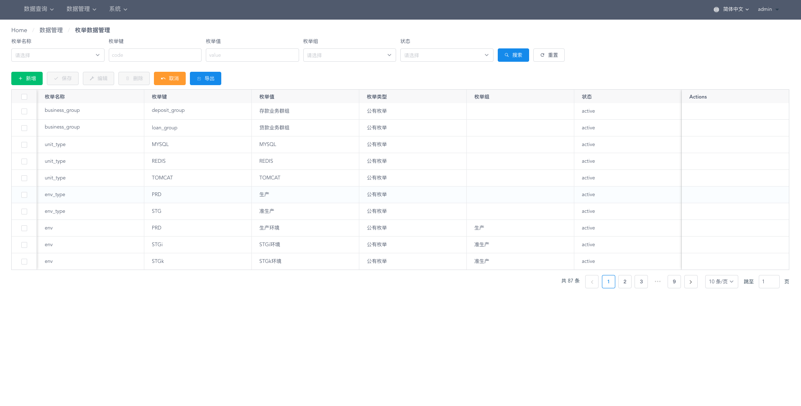

## Data enquiry

Data enquiry is composed of CI data enquiry, CI data integrated enquiry, enum data enquiry

### CI data enquiry

1. After open CI data enquiry page, CMDB data model diagram is displayed, the diagram just displays CIs which status are created and dirty. By hovering the mouse over a CI node, all relationship of the CI will be highlighted.
   
1. Click CI and open data enquiry page, CI data can be queried.
   

### CI data integrated enquiry

1. Select root CI, and select integrated enquiry name to process integrated enquiry.
   
1. Clicking _Display message_ can display the _url_,_payload_, and _result_.
   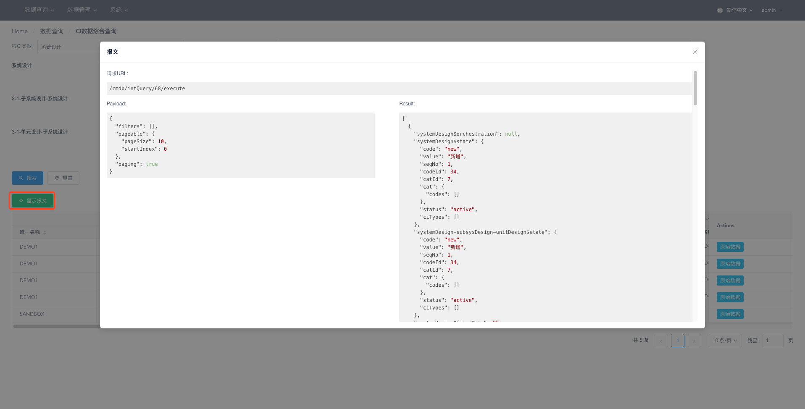
1. Clicking _raw data_ behide a message can display detail information of the message.
   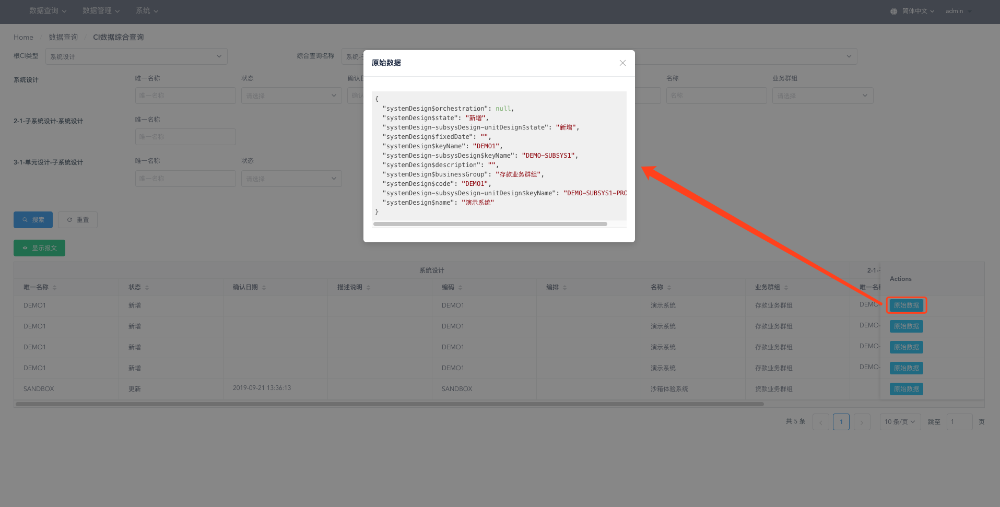

### Enum data enquiry

1. Enum data enquiry page provide query functionality for public and private enum data.
   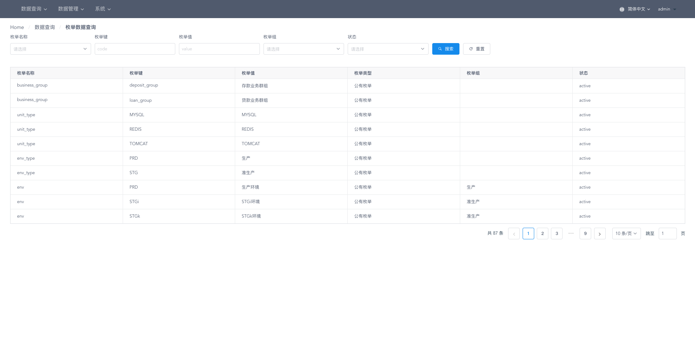

## View management

### IDC planning design

1. Select IDC, display the IDC planning design diagram, scrolling mouse wheel can zoom in or zoom out the design diagram.
   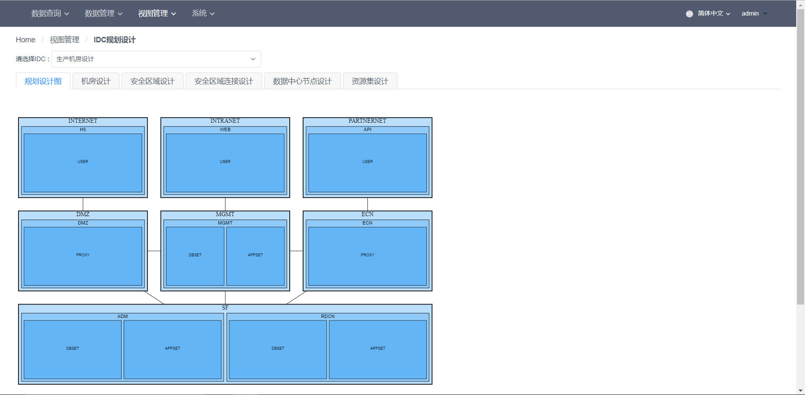

1. Select any other tab beside "IDC planning design diagram" tab, next planning design item can be processed for the selected IDC.
   

### IDC resource planning

1. Select IDC, display the IDC's resource planning diagram, scrolling mouse wheel can zoom in or zoom out the planning diagram.
   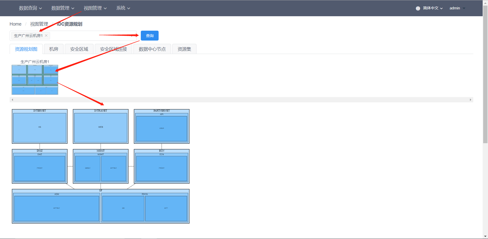

1. Select any other tab beside "IDC resource planning diagram" tab, plan can be made for the selected resource of the IDC.
   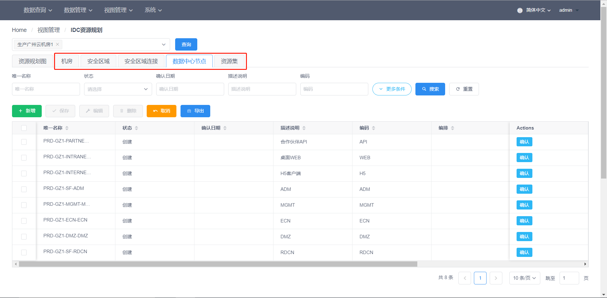

### App architecture design

1. Select system design, display the application architecture diagram of the system, scrolling mouse wheel can zoom in or zoom out diagram.
   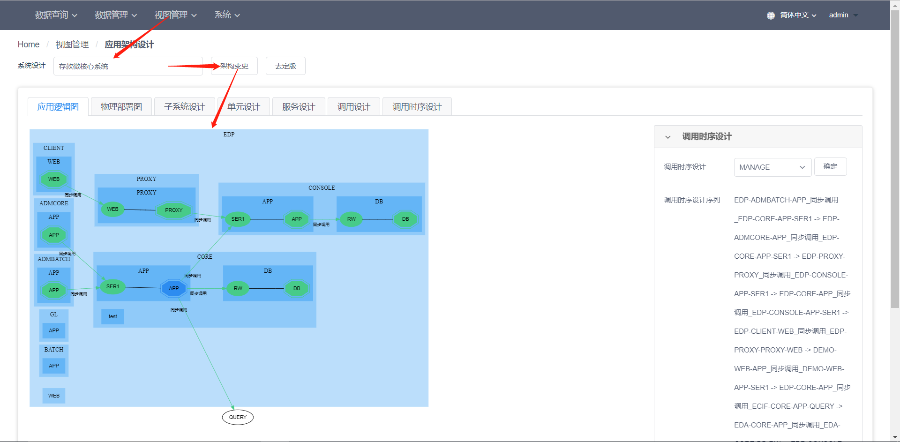
1. Select the "Invocation sequence design" on the right side of diagram, click Ok, list the sequence invocation steps, press left or right arrow, the according invocation of applications will be display.
   
1. Select "Physical deployment diagram" tab beside "App architecture design diagram", the according physical deployment information can be explored
   

1. Select any tab on the right side of "physical deployment diagram", the according configure item can be processed (e.g. Invocation sequence design)
   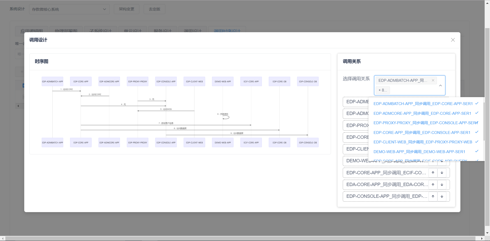

### Application deployment design

1. Select system design, the according app deployment diagram will be displayed, scrolling mouse wheel can zoom in or zoom out the diagram.
   

1. Select "App deployment design tree diagram" tab beside "App deploy design diagram", the app deployment design tree diagram will be displayed, scrolling mouse wheel can zoom in or zoom out the diagram.
   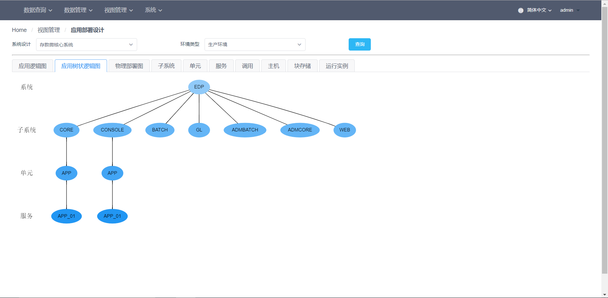

1. Select "Physical deployment diagram" table beside "App deployment design tree diagram", the app deployment diagram can be displayed, scrolling mouse wheel can zoom in or zoom out the diagram.
   

1. Select any table beside "Physical deployment diagram", the according configure item can be processed.
   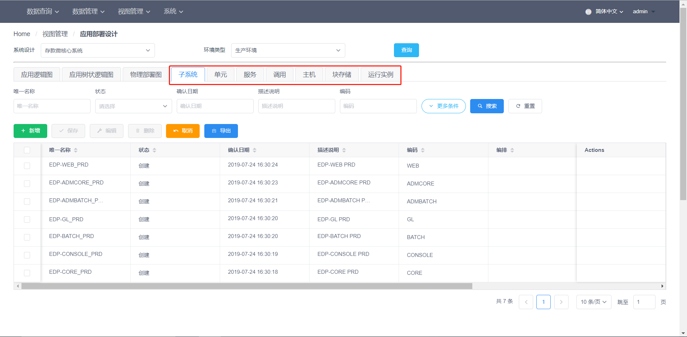
