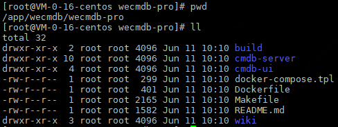

# We-cmdb Compile Guide

## 编译前准备
1. 准备一台linux主机；
2. 操作系统版本建议为ubuntu16.04以上或centos7以上；
3. 网络需要可通外网(需从外网下载依赖包)；
4. 安装Git
	- yum安装 
	```bash
    yum install -y git
    ```
	- 手动安装，请参考[git安装文档](git_install_guide.md)

5. 安装docker1.17.03.x以上
    - yum安装 
    ```bash
    yum-config-manager --add-repo http://mirrors.aliyun.com/docker-ce/linux/centos/docker-ce.repo
    yum makecache fast
    yum install docker-ce -y
    ```
	- 手动安装，请参考[docker安装文档](docker_install_guide.md)
	
6. 启动docker
    ```bash
    systemctl start docker
    ```


## 编译过程
1. 通过github拉取代码

	切换到本地仓库目录， 执行命令 
	
	```
	cd /app/wecmdb/	
	git clone https://github.com/WeBankPartners/we-cmdb.git
	```

	根据提示输入github账号密码， 即可拉取代码到本地。
	拉取完成后， 可以在本地目录上看到we-cmdb目录， 进入目录，结构如下：

	
	
2. 拉取alpine基础镜像和ccr.ccs.tencentyun.com/webankpartners/golang-ext:v1.15.6镜像
    ```bash
    docker pull alpine
    docker pull ccr.ccs.tencentyun.com/webankpartners/golang-ext:v1.15.6
    ```
    ccr.ccs.tencentyun.com/webankpartners/golang-ext:v1.15.6的镜像是在官方golang:1.15.6的基础上装了一些扩展包
    查看镜像列表  
    

3. 安装node.js(推荐)或拉取node:12.13.1镜像
	
	因为node的docker镜像实在太大了，而且速度又慢，推荐安装node.js  
	
	- 手动安装  
	```bash
    cd /usr/local/src
    wget https://npm.taobao.org/mirrors/node/v14.7.0/node-v14.7.0-linux-x64.tar.xz
    xz -d node-v14.7.0-linux-x64.tar.xz
    tar xf node-v14.7.0-linux-x64.tar
    mv node-v14.7.0-linux-x64 node
    ```
    配置系统变量PATH，如果要保存的话请写入系统或用户环境变量文件中
    ```bash
    export NODEPATH=/usr/local/src/node
    export PATH=$PATH:$NODEPATH/bin
	```
	- yum安装
	```bash
    yum install nodejs -y
    ```
    - docker方式
    ```bash
    docker pull node:12.13.1
    ```
	
4. 编译打包成镜像
	
	进入项目的根目录
	```bash
    cd /app/wecmdb/we-cmdb
    make image PLUGIN_VERSION=v0.0.1
    ```
    如果第一次npm build前端时报错 "Error: EACCES: permission denied, mkdir '/app/wecmdb/we-cmdb/cmdb-ui/node_modules/node-sass/.node-gyp'"  
    该报错的意思是用root执行安装node-sass包权限太大，需要执行如下命令安装node-sass包  
    ```
    cd cmdb-ui
    npm install node-sass --unsafe-perm=true --allow-root
    npm install
    cd ..
    ```
    安装完后再执行 make image PLUGIN_VERSION=v0.0.1 重新安装  
    查看镜像  
    